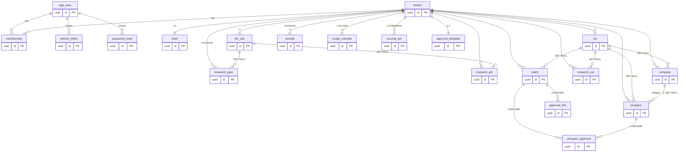

# HoldSlot — Data Schema (Apollo + internal database)

> ⭐ **This is the single source of truth for ALL data schema across the whole HoldSlot product** — every
> internal Postgres (Aurora) table plus the Apollo API field contract, all phases, built or planned. If
> any other doc (incl. [`initial-build-plan.md`](initial-build-plan.md) /
> [`backend-development-plan.md`](backend-development-plan.md)) shows a table or column differently, **this
> doc wins**, and schema changes are recorded **here first**.
>
> **A, B & C are live** (verified against [`apps/api/app/models.py`](../apps/api/app/models.py) + the
> Alembic migrations **through `0015`**, the live Aurora head — Lambda **v46** / commit `196a31e`); C is
> the **Apollo-only** find → score → select → enrich loop (see
> [`initial-build-plan.md`](initial-build-plan.md) → Phase C). The 2026-06-25 modularization + W0–W8 hardening
> pass added the perf indexes + `prospect.fit_reason` (`0014`) and the `scoring_job` async ledger (`0015`);
> the `scope_override` table (`0012`) is also defined below.
>
> **D is built (2026-06-25, code complete + tested; migration `0016` pending apply to dev Aurora).** Phase D
> (S3 · Sendout batch + client approval) adds **4 tables** — `batch`, `prospect_approval` ⭐, `approval_link`,
> `approval_template` — the revenue precondition: a `prospect_approval` row is the billable agreement S7 charges
> against, written through a tokenized, expiring, **masked** approval link (see
> [`initial-build-plan.md`](initial-build-plan.md) → Phase D). **20 tables.**

## The governing boundary

> **Apollo is a headless discovery + enrichment API. The HoldSlot DB is the only system of record.**

Apollo returns rows on a REST call (`mixed_companies/search`, `mixed_people/api_search`, `people/match`);
it stores nothing we depend on. Tenant ownership, dedup, suppression, fit scoring, lineage, and outreach
status all live in Postgres.

| | **Apollo (REST API)** | **HoldSlot DB (Aurora/Postgres)** |
|---|---|---|
| Nature | Stateless search + enrichment service | Durable system of record |
| State we keep | none — only Apollo ids (`apollo_org_id` / `apollo_person_id`) | every row |
| Knows tenants? | ❌ | ✅ `tenant_id` on every business row |
| Authoritative for | discovery + enrichment data only | everything else |

**Conventions (built tables):** PKs are `uuid` (`gen_random_uuid()`); `tenant_id` is a FK to `tenant`
(`ON DELETE CASCADE`) and **is the spec's `client_id`** (same value, two names); timestamps are
`timestamptz`; `created_at`/`updated_at` default to `now()` (`updated_at` via `onupdate`). Status fields
that may grow new values are **plain strings, not DB enums**, to avoid migrations.

---

# Part 1 — Apollo (headless discovery + enrichment API)

**Apollo is a REST service, not a durable store — there is no Apollo-side table to define.** HoldSlot calls
three endpoints and persists the results into Postgres (Part 2). Auth = header **`X-Api-Key`** from
`holdslot/prod/apollo` (`{"key": …}`). Requires **Apollo Professional + master API key**; on the free key
every Search/Match call 403s (`API_INACCESSIBLE`) — only `organizations/enrich` works.

### Endpoints (confirmed from Apollo docs + live-API deep research 2026-06-21)
| Purpose | Endpoint | Credits | Returns |
|---|---|---|---|
| Find Company | `POST /api/v1/mixed_companies/search` | **⚠️ plan credits** (Apollo's current docs list it as credit-consuming — the old "search is free" model is retired; **confirm exact cost at C0**) | org rows (firmographics, `apollo_org_id`) |
| Find People | `POST /api/v1/mixed_people/api_search` | **0** | person rows, **no email/phone**; needs master key |
| Enrich | `POST /api/v1/people/match` | **1/email · 8/phone** | verified email/phone/provider for ONE person |

Never call legacy `/api/v1/mixed_people/search` (returns 422). Pagination: `per_page` (≤100) + `page`,
**Apollo hard cap 500 pages = 50k rows**, with 429 backoff. `PHONE_ENABLED=false` at dogfood →
`reveal_phone_number=false` (phone is also **async → requires a `webhook_url`**, so it stays off at MVP).

### Request-param contract (input side — `apollo_map` forwards `ResearchSpec` v3 params)
**v3 is Apollo-native:** the LLM emits the exact Apollo request fields by name, so `apollo_map` forwards
them with no vocabulary translation — it only merges server config (`credit_policy`) + the Flow-A→B
`organization_ids`. `⊘` = no Apollo request param → **DB-side post-filter** (see initial-build-plan → Phase C).

**Find Company (`mixed_companies/search`) ← `spec.company_search_params` + `spec.intent_filters.company`**
| Apollo request param | Type / vocabulary | source field |
|---|---|---|
| `q_organization_keyword_tags[]` | free-text keywords (industry/vertical — no industry-id field) | `company_search_params.q_organization_keyword_tags` |
| `organization_num_employees_ranges[]` | array of `"min,max"` strings | `company_search_params.organization_num_employees_ranges` |
| `organization_locations[]` | lowercase free text (country/US-state/city) | `company_search_params.organization_locations` |
| `revenue_range[min]` / `[max]` | int (plan-gated) | `company_search_params.revenue_range {min,max}` |
| `latest_funding_date_range[min]` / `[max]` | `YYYY-MM-DD` | `intent_filters.company.latest_funding_date_range` |
| `q_organization_job_titles[]` · `organization_job_posted_at_range[min/max]` | free text · date | `intent_filters.company.*` (hiring signal) |
| `page` / `per_page` (≤100) | int | paginate to `credit_policy.max_companies` |

**Find People (`mixed_people/api_search`) ← `spec.people_search_params` + selected orgs**
| Apollo request param | Type / vocabulary | source field |
|---|---|---|
| `organization_ids[]` | Apollo org ids | **selected** `company.apollo_org_id` (Flow A→B scope link — required; empty ⇒ 400) |
| `person_titles[]` | free text, fuzzy | `people_search_params.person_titles` |
| `include_similar_titles` | bool | `people_search_params.include_similar_titles` |
| `q_keywords` | single string (industry/vertical for people) | `people_search_params.q_keywords` |
| `person_seniorities[]` | **fixed enum:** owner·founder·c_suite·partner·vp·head·director·manager·senior·entry·intern | `people_search_params.person_seniorities` |
| `organization_locations[]` | free text (employer HQ) | `people_search_params.organization_locations` |
| `organization_num_employees_ranges[]` | array of `"min,max"` | `people_search_params.organization_num_employees_ranges` |
| `contact_email_status[]` | enum: verified·unverified·likely to engage·unavailable | `credit_policy.email_status_filter` (server-set) |
| `page` / `per_page` (≤100) | int | paginate to `credit_policy.max_people` |

> **⚠️ Phase C build — verify against live fixtures before hard-coding (research-flagged unconfirmed):**
> (1) the funding-**stage** filter — likely key `organization_latest_funding_stage_cd[]`, but the exact key
> and its code values (string vs numeric) are **not authoritatively published**; (2) `person_departments`/
> `person_functions` are **UI-only — not API request params** (hence departments is DB-side here); (3)
> there is **no API title-exclude and no per-company cap param** (both DB-side); (4) company-search credit
> consumption — confirm at C0. Lock `apollo_map` to what the C0 fixtures actually accept/return.

### Company search → `company` row (`apollo_map.parse_company`, pure, fixture-tested)
| Apollo field | → our field |
|---|---|
| `organization.id` | `apollo_org_id` (upsert key; feeds Find People's `organization_ids`) |
| `name` | `name` |
| `primary_domain` / `website_url` | `domain` (normalized dedupe key) / `website` |
| `linkedin_url` | `linkedin_url` |
| `industry` | `industry` |
| `estimated_num_employees` | `size` |
| `city`/`state`/`country` | `country` (+ locality → `evidence`) |
| `annual_revenue`, `founded_year`, `technology_names`, `keywords` | → `evidence` JSONB |

### People search → `prospect` row (`parse_person`; email/phone NULL at this stage)
| Apollo field | → our field |
|---|---|
| `id` | `apollo_person_id` (upsert key; the `people/match` handle) |
| `name` | `enrichment.full_name` |
| `title` | `enrichment.title` |
| `seniority` | `enrichment.seniority` |
| `linkedin_url` | `enrichment.linkedin_url` |
| `organization.name` / `primary_domain` | `enrichment.company` / `enrichment.domain` |
| (searched org) | `company_id` linked directly (we know which `apollo_org_id` we queried) |

`identity_key` is computed from the row (LinkedIn slug → `domain\|last\|first` → email) exactly as before —
the dedupe key + future `person` FK seam. Email/phone stay NULL until enrich.

### Enrich (`people/match`) → fills the `prospect` contact fields (the heavy credit spend)
Run **only** on the human-selected set at gate 2. `match_person(apollo_person_id, reveal_personal_emails=true,
reveal_phone_number=PHONE_ENABLED)`. Phone (8 cr) is delivered **asynchronously to a `webhook_url`**, not in
the sync response — off at MVP, so the sync email path is all we wire:
| Apollo field | → our field |
|---|---|
| `email` | `enrichment.email` (+ normalized) |
| `email_status` (`verified`/…) | `email_valid` (truthy set) |
| `phone_numbers[]` | `enrichment.phone` (only if `PHONE_ENABLED`) |
| `email`/provider source | `enrichment.provider` |

### Credit discipline (enforced in code)
1. **People search is 0 credits; company search consumes plan credits** (confirm cost at C0) — paginate
   company search only to `max_results`, cache/dedup rows, and **never call `people/match` before gate 2**.
2. **Exclusion / existing-customer filtering + all `⊘` post-filters are DB-side** (the `suppression.py`
   gate + result post-filter), not extra API calls.
3. **Dedup before enrich** on `apollo_person_id` / `identity_key` — a person already enriched is never
   re-matched (no double charge).
4. **Enrich only the selected set**; phone off by default (8× email cost + async webhook).

---

# Part 2 — Internal database

## Entity-relationship overview (20 tables · head `0016`)

Clusters: Identity/Tenancy (global), Phase B Targeting, Phase C Apollo find→enrich, the W4
async-scoring `scoring_job` ledger + the `scope_override` Find-Settings store, and **Phase D**
batch/approval (`batch`, `prospect_approval`, `approval_link`, `approval_template`). The ORM
([`apps/api/app/models.py`](../apps/api/app/models.py)) matches the migrations — **no drift**.

**Relationship notes:**
- **`tenant` is the spine** — every business table `ON DELETE CASCADE`s from it.
- Identity is global — `app_user` ↔ `tenant` is many-to-many via `membership`;
  `refresh_token`/`password_reset` hang off the user.
- `icp` and `llm_call` are soft refs (`SET NULL`) — deleting them orphans but doesn't destroy.
- **Two-stage flow** — `company` (Stage 1, dedup `domain`, Apollo via `apollo_org_id`) →
  `prospect` (Stage 2, dedup `identity_key`, via `company_id` + `apollo_person_id`).
  `prospect.last_enriched_at` is the seam for a future shared `person`/enrichment cache.
- Versioned config — `research_spec`, `prompt` (per tenant×stage), `research_run` (cost ledger) — append-only.
- `scope_override` (`0012`) and `scoring_job` (`0015`) are **operational ledgers**, not business entities:
  one `scope_override` per (tenant, kind); one in-flight `scoring_job` per (tenant, kind).
- **Phase D (`0016`)** — `batch` groups enriched `prospect` rows; each (prospect × batch) gets one
  append-only `prospect_approval` ⭐ (the billable record); `approval_link` is the tokenized expiring
  link (mirrors `password_reset`); `approval_template` is one sendout-copy doc per tenant (mirrors
  `brief`). `prospect_approval`/`approval_link` **CASCADE** from `batch`; counts are **derived**, never
  stored. The masked external serializer reads `prospect`+`company` but emits fit context only.

## Phase A (S0) — Identity & tenancy core ✅ BUILT
Migration `20260611_0001_baseline` (+ `0002_seed`). Identity tables are **global**; a user joins tenants
via `membership`. Today `tenant` holds exactly HoldSlot (#0); a paying client later is one `INSERT`.

### `tenant`
| Column | Type | Notes |
|---|---|---|
| `id` | uuid PK | |
| `slug` | varchar(63) **unique** | drives `holdslot.com/<slug>` |
| `name` | varchar(255) | |
| `status` | enum `tenant_status` (`active`/`suspended`) | |
| `created_at`, `updated_at` | timestamptz | |

### `app_user`
| Column | Type | Notes |
|---|---|---|
| `id` | uuid PK | |
| `email` | varchar(320) **unique** | stored lowercase (no citext) |
| `password_hash` | varchar(255) | argon2 |
| `full_name` | varchar(255) nullable | |
| `status` | enum `user_status` (`active`/`disabled`) | |
| `last_login_at` | timestamptz nullable | |
| `created_at`, `updated_at` | timestamptz | |

### `membership` — the tenant↔role join (build single, design multi)
| Column | Type | Notes |
|---|---|---|
| `id` | uuid PK | |
| `user_id` | uuid FK → `app_user` (CASCADE) | idx |
| `tenant_id` | uuid FK → `tenant` (CASCADE) | idx |
| `role` | enum `membership_role` (`owner`/`member`) | role is on the membership, not the user |
| `created_at` | timestamptz | |
| | | **unique(`user_id`,`tenant_id`)** |

### `refresh_token`
| Column | Type | Notes |
|---|---|---|
| `id` | uuid PK | |
| `user_id` | uuid FK → `app_user` (CASCADE) | idx |
| `token_hash` | varchar(64) **unique** | |
| `expires_at` | timestamptz | |
| `revoked_at` | timestamptz nullable | |
| `created_at` | timestamptz | |

### `password_reset`
| Column | Type | Notes |
|---|---|---|
| `id` | uuid PK | |
| `user_id` | uuid FK → `app_user` (CASCADE) | idx |
| `token_hash` | varchar(64) **unique** | |
| `expires_at` | timestamptz | |
| `used_at` | timestamptz nullable | one-click reset link flow |
| `created_at` | timestamptz | |

## Phase B (S1) — Targeting: Brief & ICP → ResearchSpec ✅ BUILT
Migrations `20260612_0003_phase_b_targeting` (+ `0004_icp_suggestions`). Form documents are **opaque
JSONB** (a form change is a frontend edit, never a migration); `research_spec` is the versioned search
contract (**v3**, Apollo-native), append-only, each linked to the `llm_call` that produced it.

### `brief` — one per tenant
| Column | Type | Notes |
|---|---|---|
| `id` | uuid PK | |
| `tenant_id` | uuid FK (CASCADE) | **unique per tenant**; idx |
| `data` | JSONB (default `{}`) | the opaque form document |
| `created_at`, `updated_at` | timestamptz | |

### `icp` — many per tenant
| Column | Type | Notes |
|---|---|---|
| `id` | uuid PK | |
| `tenant_id` | uuid FK (CASCADE) | idx |
| `name`, `tag` | varchar(255) | card header |
| `data` | JSONB (default `{}`) | the opaque form document |
| `created_at`, `updated_at` | timestamptz | |

### `llm_call` — the one-seam LLM telemetry (append-only)
Written by the B3 OpenRouter adapter on **every** call; every later AI feature (fit scoring, sourcing,
recaps) writes through it.
| Column | Type | Notes |
|---|---|---|
| `id` | uuid PK | |
| `tenant_id` | uuid FK (CASCADE) | idx |
| `purpose` | varchar(64) | `brief_structure` today; `prospect_fit`/`sourcing_round`/… in C; idx |
| `model` | varchar(128) nullable | model actually served |
| `prompt_version` | varchar(64) nullable | the loop's instrument |
| `status` | varchar(32) | `ok`/`parse_error`/`timeout`/`error` (string, not enum) |
| `input_tokens`, `output_tokens` | int nullable | |
| `cost_usd` | numeric(14,8) nullable | OpenRouter usage/cost |
| `latency_ms` | int nullable | |
| `retries` | int (default 0) | |
| `raw` | JSONB nullable | raw completion — top debugging signal; parse failures recorded before retry |
| `created_at` | timestamptz | |

### `research_spec` — append-only versioned **v3** search contract (Apollo-native)
| Column | Type | Notes |
|---|---|---|
| `id` | uuid PK | |
| `tenant_id` | uuid FK (CASCADE) | idx |
| `version` | int | **unique(`tenant_id`,`version`)**; re-run inserts the next version |
| `spec` | JSONB | **v3** targeting (company_search_params · people_search_params · intent_filters · icp_validation + server-merged credit policy) |
| `gaps` | JSONB (default `[]`) | value-loop prompts (`{field, why_it_matters, ask}`) |
| `icp_suggestions` | JSONB (default `[]`) | proposed ICPs from the existing-customer list (added `0004`) |
| `model` | varchar(128) nullable | |
| `llm_call_id` | uuid FK → `llm_call` (SET NULL) nullable | traces spec → exact model/cost/raw output |
| `created_at` | timestamptz | |

**`research_spec.spec` — the v3 JSON contract** (`spec_version = 3`; what the LLM emits + what
`apollo_map` forwards — fields are **exact Apollo request params**, full mapping in *Request-param
contract* above). The strict `json_schema` lives in
[`research_spec.py`](../apps/api/app/domains/briefs/research_spec.py); the workspace *Prospect Scope*
panel renders every field below for operator review.

- **`company_search_params`** — `q_organization_keyword_tags[]` · `organization_num_employees_ranges[]`
  (comma-strings `"10,100"`) · `organization_locations[]` (lowercase HQ) · `revenue_range{min,max}` (int)
- **`people_search_params`** — `person_titles[]` · `include_similar_titles` (bool) ·
  `q_keywords` (single string — industry/vertical for people) · `person_seniorities[]` (**fixed enum:**
  owner·founder·c_suite·partner·vp·head·director·manager·senior·entry·intern) ·
  `organization_locations[]` · `organization_num_employees_ranges[]`
- **`intent_filters`** — `company{latest_funding_date_range{min,max} (YYYY-MM-DD),
  q_organization_job_titles[], organization_job_posted_at_range{min,max}}` ·
  `recency_window{funding_since, jobs_posted_since}` (echo of the lower bounds, computed from `today`)
- **`icp_validation`** (analysis, NOT Apollo-bound — the paying-customer read from the brief's
  `excludeCustomers` list) — `customer_profiles[]{name, domain, industry, employee_band, hq_country,
  business_model, source:"knowledge"|"web", confidence}` · `paying_customer_summary`
- **`credit_policy`** (deterministic **server config**, never LLM-set; merged at save time) —
  `email_status_filter` (default `["verified"]` → `contact_email_status`) · `phone` (default `false`) ·
  `max_companies` (500) · `max_people` (800)

`gaps` + `icp_suggestions` are separate columns (above) — value-loop signals, never folded into `spec`.
Each `icp_suggestions[]` entry is `{name, rationale, evidencing_customers[], confidence,
company_search_params{…}, people_search_params{…}}` — a ready-to-run ICP the operator can accept.
**Brief-side exclusions** (`excludeCustomers`/`excludeDeals`/`doNotContact`) feed suppression directly
from the brief text (not the spec) — v3 emits no `exclusions` block.

### `research_job` — async structuring job tracker (`0009`)
Scoping runs **DeepSeek V4 Pro** (thinking + web-search plugin, ~55-76s) — past the API Gateway
HTTP-API hard 30s cap. So `POST /brief/structure` inserts a `queued` row and fires a background
worker (Lambda **self async-invoke**; a thread in local dev) that runs the LLM, inserts the next
`research_spec` version, and flips this row terminal. The UI polls `GET /brief/structure/status`.
One in-flight job per tenant (a queued/running job is returned as-is) so a double-click can't double-spend.
| Column | Type | Notes |
|---|---|---|
| `id` | uuid PK | |
| `tenant_id` | uuid FK (CASCADE) | idx |
| `status` | varchar(16) (default `queued`) | `queued`→`running`→`done`\|`error` (string, not enum) |
| `spec_version` | int nullable | set on `done` — the `research_spec.version` produced |
| `error` | text nullable | set on `error` — short human-facing cause |
| `llm_call_id` | uuid FK → `llm_call` (SET NULL) nullable | the call that produced the spec |
| `created_at`, `updated_at` | timestamptz | |

## Phase C (S2) — Prospects: company-first, two-stage (Apollo find → enrich) ✅ BUILT & LIVE (Lambda v46)
Follows the same conventions; all carry `tenant_id` (= `client_id`), scoped by the A4 guard. **Built today:
`prospect` + `research_run` + `prompt` (created as `sourcing_doc` in `0005`, renamed `0010`), `company`
+ `prospect.company_id` (`0007`), `company.website` (`0008`), `research_job` async-structuring tracker
(`0009`, Phase B). The Apollo rebuild adds `0011`: `company.apollo_org_id` + `prospect.apollo_person_id`, and **drops**
`tenant.seed_limit` (`0006`, AI-loop seed anchoring — removed). The C8–C10 + W0–W8 deltas add `scope_override`
(`0012`), the `company_fit`/`prospect_fit` rubric split (`0013`), the hot-read composite indexes +
`prospect.fit_reason` (`0014`), and the `scoring_job` async ledger (`0015`).
The two SCALE tables (`person` / `enrichment_request`) are the additive multi-tenant step, not built.**

> **Hot-read indexes (`0014`, W1):** `prospect` and `company` each carry a composite
> `(tenant_id, fit_score DESC NULLS LAST, created_at DESC)` index (`ix_prospect_tenant_fit` /
> `ix_company_tenant_fit`) matching the exact `ORDER BY` of the `/{client}/prospects` + `/{client}/companies`
> list feeds, so the hottest read returns rows pre-ordered (W5 cursor pagination adds an `id` tiebreaker). Four
> now-redundant single-column indexes were dropped (`ix_company_domain`, `ix_prospect_identity_key`,
> `ix_brief_tenant_id`, `ix_scope_override_tenant_id` — each covered by a UNIQUE constraint's index).

### Phase C end-to-end flow (Apollo, programmatic — two gates, no CSV)
The objective is two gates: **(1) find companies likely to buy, (2) find the right person at each.**
Division of labor — **`apollo_map`** (pure, deterministic) forwards the Apollo request from the v3 spec; the
**LLM** only fit-scores; **Apollo** searches + enriches; **DB** is the system of record. No operator, no CSV:

1. **Find Company** — `apollo_map.map_company_filter(spec.company_search_params, spec.intent_filters)` → Apollo
   `mixed_companies/search` (**plan credits**) → DB-side post-filter + exclusion drop → upsert on
   `apollo_org_id` → batched **company fit-score** → `company` rows (`discovered`).
2. **Gate 1** — user reviews/selects (`PATCH companies/select` → `selected`); may **manually add** a
   company (same schema, `source=manual`).
3. **Find People** — `apollo_map.map_people_filter(spec.people_search_params, org_ids=selected)` → Apollo
   `mixed_people/api_search` (0 cr, no email) → DB-side post-filter + exclusion drop → upsert on
   `apollo_person_id`, link `company_id` directly → batched **person fit-score** → `prospect` rows
   (`found`, unenriched).
4. **Gate 2 (enrich gate)** — user reviews scores and **confirms who to enrich** (`POST prospects/enrich`);
   may **manually add** a person (same schema, `source=manual`).
5. **Enrich** — Apollo `people/match` on the confirmed set only (1 credit/email; phone off by default) →
   `enrichment.email`/`email_valid`/`phone`/`provider`, re-scored → `scored`.
6. **Create batch** — group enriched prospects → Phase D approval (the real `batches` table is Phase D).

**Credit discipline:** people search is **0 credits**; **company search consumes plan credits** (confirm
at C0); only the gate-4 confirmed set spends at `people/match`. Suppression/exclusions + `⊘` post-filters
apply DB-side on every search.

### `company` ✅ MVP (`0007`) — stage-1 discovery, per-(domain × tenant)
| Column | Type | Notes |
|---|---|---|
| `id` | uuid PK | |
| `tenant_id` | uuid FK (CASCADE) | idx |
| `icp_id` | uuid FK → `icp` (SET NULL) nullable | which ICP sourced it |
| `run_id` | uuid/str nullable | = `research_run.run_id` (the find run) |
| `apollo_org_id` | varchar nullable | Apollo org id (`0011`); upsert key + feeds Find People's `organization_ids`; **unique per tenant** |
| `domain` | varchar **idx** | dedupe key; **unique(`tenant_id`,`domain`)** |
| `website` | varchar nullable | raw company URL (`0008`); `domain` stays the normalized dedupe key |
| `linkedin_url` | varchar nullable | company LinkedIn |
| `name` | varchar | |
| `industry`, `size`, `country` | varchar nullable | firmographics from Apollo company search |
| `fit_score` | int nullable | company-level fit (reuses `fit.py`, persona lines omitted) |
| `fit_tier` | varchar nullable | Strong/Good/Moderate/Below |
| `fit_reason` | text nullable | "why a fit" (client-facing) |
| `fit_components` | JSONB (default `{}`) | rubric line-items + reason tags |
| `evidence` | JSONB (default `{}`) | citations / extras (revenue, employee count, locality) |
| `source` | varchar | `apollo` \| `manual` |
| `status` | varchar | `discovered` → `selected` → `people_found` → `archived` (selection lives here — no separate `selected` column) |
| `created_at` | timestamptz | |
| | | dedupe: re-import the same `domain` is idempotent |

### `prospect` ⬜ MVP — per-(identity × tenant) targeting record
| Column | Type | Notes |
|---|---|---|
| `id` | uuid PK | |
| `tenant_id` | uuid FK (CASCADE) | idx |
| `icp_id` | uuid FK → `icp` (SET NULL) nullable | which ICP sourced it |
| `company_id` | uuid FK → `company` (SET NULL) nullable | the company this person belongs to (two-stage link; resolved by domain on import) |
| `spec_version` | int nullable | `research_spec.version` used |
| `run_id` | uuid/str | = `research_run.run_id` (the find run) |
| `apollo_person_id` | varchar nullable | Apollo person id (`0011`); upsert key + the `people/match` handle |
| `identity_key` | varchar **idx** | normalized LinkedIn / `domain\|last\|first` / email — **dedupe + future `person` FK seam** |
| `enrichment` | JSONB | raw Apollo search/match row; no S3 at MVP volume |
| `email_valid` | bool | |
| `fit_score` | int nullable | |
| `fit_tier` | varchar | Strong/Good/Moderate/Below |
| `fit_components` | JSONB | the 12 rubric line-items + reason tags |
| `fit_reason` | text nullable | "why a fit" client-facing copy (→ Phase D); a real column (`0014`, parity with `company.fit_reason`) — populated on next rescore, no backfill |
| `source` | varchar | `apollo` \| `manual` (origin, not transport) |
| `source_lineage` | JSONB | run + rubric version |
| `status` | varchar | `found`→`confirmed`(to enrich)→`scored`; `suppressed`/`score_error` (string, not enum) |
| `outreach_outcome` | varchar nullable | null until Phase E writes it (closes the self-improve loop) |
| `last_enriched_at` | timestamptz nullable | TTL-gates re-enrichment (~90d) + future `person` FK seam |
| `created_at` | timestamptz | |
| | | dedupe: re-import the same `identity_key` is idempotent |

### `research_run` ⬜ MVP — one per find run (company or people)
| Column | Type | Notes |
|---|---|---|
| `id` | uuid PK | |
| `tenant_id` | uuid FK (CASCADE) | idx |
| `run_id` | uuid/str **unique** | the find-run handle |
| `spec_version` | int nullable | |
| `icp_id` | uuid FK → `icp` nullable | |
| `source` | varchar | `apollo` |
| `prompt_version`, `rubric_version` | varchar nullable | which spec (`brief-structure`) / fit-rubric (`company_fit`/`prospect_fit`) versions ran |
| `rows_pushed`, `rows_accepted` | int | the run's scoreboard (found / scored) |
| `cost_usd` | numeric nullable | LLM spend → per-run $/accepted (Apollo enrich-credit cost not stored — reconcile from the Apollo dashboard) |
| `created_at` | timestamptz | |

### `prompt` ⬜ MVP — append-only per-client prompt store (renamed from `sourcing_doc`, `0010`)
The single home for every client-editable prompt, versioned per `(tenant, stage)`; the latest
version is active. (Was `sourcing_doc` with a `kind` column — renamed once it grew past sourcing.)
| Column | Type | Notes |
|---|---|---|
| `id` | uuid PK | |
| `tenant_id` | uuid FK (CASCADE) | idx |
| `stage` | varchar(32) | `briefing` (Brief→ResearchSpec scoping) · `sourcing` (legacy, retired) · **`company_fit`** (Step-1 company rubric) · **`prospect_fit`** (Step-2 people rubric) — split from `fit_scoring` in `0013` |
| `version` | int | **unique(`tenant_id`,`stage`,`version`)**; append-only |
| `body` | text | seed v1 from `docs/prompts/*.md` in the migration (`briefing`←`brief-structure-v5.md`; `company_fit`/`prospect_fit`←`fit-scoring-rubric-v1.md` via the `0005`→`0010`→`0013` chain) |
| `created_at` | timestamptz | |

The briefing prompt is read DB-first by the scoping worker; if absent it falls back to the code
default (`DEFAULT_SYSTEM_PROMPT`, the Lambda bundle has no `docs/`). Saving in the UI appends the
next `briefing` version; an empty save resets to the default text.

### `scope_override` ✅ MVP (`0012`) — persisted Find-Settings override, one row per (tenant, kind)
The Step-2 *Find People · who to target* facets (Management Level × Department) were a per-browser
localStorage override; this moves them server-side so a saved tuning survives reloads/devices and a stale
local entry can't silently shadow the AI scope. Single-row **UPSERT**; deleting the row reverts to the
`research_spec` scope. `kind='people'` today (the facet override); `company` (Step-1) can reuse the same
table later. See [`initial-build-plan.md`](initial-build-plan.md) → Phase C → C9.
| Column | Type | Notes |
|---|---|---|
| `id` | uuid PK | |
| `tenant_id` | uuid FK (CASCADE) | **unique(`tenant_id`,`kind`)** (`uq_scope_override_tenant_kind`) |
| `kind` | varchar(16) | `people` (Step-2 facets) · `company` (Step-1, reserved) |
| `params` | JSONB (default `{}`) | the opaque override merged over `research_spec` at find time |
| `created_at`, `updated_at` | timestamptz | `updated_at` kept fresh by the `set_updated_at()` trigger (attached in `0014`) under raw UPSERT |

### `scoring_job` ✅ MVP (`0015`, W4) — async fit-scoring job ledger, one in-flight per (tenant, kind)
The five scoring-bearing surfaces (find-company, find-lookalikes, company/prospect rescore, company
field-refresh) fan out one fit LLM call per row; a large batch exceeds the API Gateway 30s cap and the
prior client-driven chunk loop died if the tab closed. So scoring moved **async**: a `…-async` kick-off
endpoint inserts a `queued` row and fires a background worker (Lambda self async-invoke; a thread locally)
that flips it `running`→`done`/`error` and records per-run counts on `result`. Mirrors `research_job`
(`0009`); a **job ledger**, not a business entity. `ASYNC_BATCH_MAX = 20`. Poll `GET /{client}/scoring-jobs/{job_id}`.
See [`initial-build-plan.md`](initial-build-plan.md) → *Modularization + W0–W8* (W4).
| Column | Type | Notes |
|---|---|---|
| `id` | uuid PK | |
| `tenant_id` | uuid FK (CASCADE) | idx `ix_scoring_job_tenant_kind` on (`tenant_id`,`kind`); single in-flight per kind |
| `kind` | varchar(32) | which scoring surface (`find_company`/`find_lookalikes`/`company_rescore`/`prospect_rescore`/`update_fields`) |
| `params` | JSONB (default `{}`) | the original request body |
| `status` | varchar(16) (default `queued`) | `queued`→`running`→`done`\|`error` (string, not enum) |
| `result` | JSONB (default `{}`) | per-run counts (scored/failed) |
| `error` | text nullable | set on `error` |
| `created_at`, `updated_at` | timestamptz | `updated_at` via ORM `onupdate` (no trigger needed) |

## Phase D (S3) — Sendout batch & client approval ✅ BUILT (code complete + tested; `0016` pending Aurora apply)
The **revenue precondition**: group enriched Phase-C prospects into a `batch`, send the client a
tokenized, expiring, **masked** approval link, record each per-prospect decision as the append-only
`prospect_approval` row S7 bills against. Reuses A/B/C primitives wholesale — the password-reset
opaque-token pattern (`approval_link` mirrors `password_reset`), the SES `send_email()` adapter, the
`require_membership(owner)` guard, the per-router `_out()` serializers — so **no EventBridge, no async
worker, no new AWS resources** (expiry is checked on read, a send is one SES call). The masking
allow-list serializer (`domains/approvals`) is the anti-data-theft control: the public endpoint emits
**fit context only** (name+initial · company *descriptor* · title/seniority · fit tier+reason), never a
clear-text identity/contact vector. Console surface = `domains/batches`; counts are **derived** from
`prospect_approval`, never stored. See [`initial-build-plan.md`](initial-build-plan.md) → Phase D.

### `batch` ✅ (`0016`) — one sendout batch per group of enriched prospects
| Column | Type | Notes |
|---|---|---|
| `id` | uuid PK | |
| `tenant_id` | uuid FK (CASCADE) | idx `ix_batch_tenant_created` (tenant_id, created_at DESC) — the list ORDER BY |
| `icp_id` | uuid FK → `icp` (SET NULL) nullable | inferred from the prospects' shared ICP (when they agree) |
| `name` | varchar(255) | auto-named `Batch N` when omitted |
| `status` | varchar(32) (default `draft`) | `draft` → `sent` → `approved` \| `changes_requested` (string, not enum) |
| `sent_at` | timestamptz nullable | first send (kept on Follow-Up resends) |
| `decided_at` | timestamptz nullable | set when the client (or the step-3 manual fallback) decides |
| `created_at` | timestamptz | |
| | | total/approved/removed/pending counts are **DERIVED** from `prospect_approval`, never stored |
| | | a decided batch is **final** — both decide paths 409/410 a re-decide so the client's recorded choices can't be overwritten |

### `prospect_approval` ⭐ (`0016`) — the billable record, one append-only row per (prospect × batch)
| Column | Type | Notes |
|---|---|---|
| `id` | uuid PK | the opaque external decide handle (carries no identity) |
| `tenant_id` | uuid FK (CASCADE) | idx `ix_prospect_approval_tenant_id` (Phase E / billing reads) |
| `batch_id` | uuid FK → `batch` (CASCADE) | covered by the unique key's leftmost prefix (no separate idx) |
| `prospect_id` | uuid FK → `prospect` (CASCADE) | |
| `decision` | varchar(32) (default `pending`) | `pending` → `approved` \| `removed` (`request_changes` is a batch-level status) |
| `decided_at` | timestamptz nullable | |
| `created_at` | timestamptz | |
| | | **unique(`batch_id`,`prospect_id`)** (`uq_prospect_approval_batch_prospect`); **append-only** — "removed" is a value, never a delete |

### `approval_link` ✅ (`0016`) — tokenized expiring approval link (mirrors `password_reset`)
| Column | Type | Notes |
|---|---|---|
| `id` | uuid PK | |
| `tenant_id` | uuid FK (CASCADE) | |
| `batch_id` | uuid FK → `batch` (CASCADE) | idx `ix_approval_link_batch_id` (resend ladder finds a batch's links) |
| `recipient_email` | varchar(320) | the client contact the link was emailed to |
| `token_hash` | varchar(64) **unique** | SHA-256; the raw `secrets.token_urlsafe` token lives ONLY in the emailed URL |
| `expires_at` | timestamptz | validity checked **on read** (no scheduler); 7-day lifetime |
| `used_at` | timestamptz nullable | single-use |
| `created_at` | timestamptz | |
| | | resend **expires any prior live link** then mints a fresh row (only the latest send works — a mistyped earlier recipient is revoked); a decided `batch.status` makes EVERY link read `used`, and `decide` claims its link with an atomic `UPDATE … WHERE used_at IS NULL` (no double-decide / replay) |

### `approval_template` ✅ (`0016`) — one sendout-copy doc per tenant (mirrors `brief`)
| Column | Type | Notes |
|---|---|---|
| `id` | uuid PK | |
| `tenant_id` | uuid FK (CASCADE) | **unique(`tenant_id`)** (`uq_approval_template_tenant`) |
| `data` | JSONB (default `{}`) | `{subject, body, cta}` with `{{client_name}}`/`{{count}}` tokens; a code default serves until edited |
| `created_at`, `updated_at` | timestamptz | `updated_at` via ORM `onupdate` |

### Masking allow-list (the `GET /approve/{token}` serializer — D's security core)
The external (token-only, no-auth) view emits **exactly** these and nothing else (an allow-list, not a
deny-list — a new field can never leak): first name + last initial (from `enrichment.full_name`),
company *descriptor* (`company.industry`/`size`/`country`, **not** the exact name/domain),
title·seniority, `prospect.fit_tier`+`fit_reason`, plus batch name/live count/client name/`expires_at`/
state (`valid`/`expired`/`used`) — and for an **expired/used** link, ONLY `state`+`expires_at` (no
client/batch name, so a forwarded stale link can't reveal tenant existence). **Withheld:** email, phone,
**LinkedIn URL**, full last name, exact company name+domain, `fit_components`, and any verified-presence
badge. `mask_name` also defends in depth — an "@"-bearing value (an email mistaken for a name) is
reduced to its local-part name tokens, never echoed whole. (Post-booking reveal = Phase F.)

### `person` ⬜ SCALE — tenant-AGNOSTIC enrichment cache (the enrich-once seam)
Built when the 2nd tenant lands. Lets a prospect wanted by N clients be enriched once (one Apollo
`people/match`, paid once) and referenced by N `prospect` rows.
| Column | Type | Notes |
|---|---|---|
| `identity_key` | varchar **PK** | the shared key |
| `email`, `phone`, `title`, `seniority` | varchar nullable | person enrichment |
| `company_domain`, `company_industry`, `company_size` | varchar nullable | company enrichment |
| `providers` | JSONB | enrich provenance (Apollo `people/match` source) |
| `last_enriched_at` | timestamptz | re-enrich TTL |
| `created_at`, `updated_at` | timestamptz | |
| | | on SCALE, `prospect` gains FK `identity_key` → `person` and drops the embedded `enrichment` |

### `enrichment_request` ⬜ SCALE — the fan-out + dedup-before-push map
| Column | Type | Notes |
|---|---|---|
| `id` | uuid PK | |
| `run_id` | uuid/str | |
| `identity_key` | varchar FK → `person` | |
| `tenant_id` | uuid FK (CASCADE) | which tenant(s) requested this identity |
| `requested_at` | timestamptz | |
| `status` | varchar | pending/enriched/skipped(cache-hit) |

---

## Migration history (Alembic, `infra/alembic/versions/`)
| Revision | Phase | Tables / change |
|---|---|---|
| `20260611_0001_baseline` | A | `tenant`, `app_user`, `membership`, `refresh_token`, `password_reset` |
| `20260611_0002_seed` | A | seed HoldSlot tenant #0 + two founder owners |
| `20260612_0003_phase_b_targeting` | B | `brief`, `icp`, `llm_call`, `research_spec` |
| `20260617_0004_icp_suggestions` | B | `research_spec.icp_suggestions` column |
| `20260619_0005_phase_c_prospects` ✅ | C | `prospect`, `research_run`, `sourcing_doc` (MVP) + seed `sourcing_doc` v1 (fit rubric only; the retired sourcing-prompt seed was dropped) for tenant #0 from `docs/prompts/*-v1.md` |
| `20260620_0006_tenant_seed_limit` ✅ | C | `tenant.seed_limit` — **dropped in `0011`** (AI-loop seed anchoring, retired) |
| `20260620_0007_phase_c_companies` ✅ | C | `company` (stage-1 discovery) + `prospect.company_id` (applied to dev) |
| `20260621_0008_company_website` ✅ | C | `company.website` (raw URL alongside the normalized `domain`) |
| `20260622_0009_research_job` | B | `research_job` (async Brief→ResearchSpec structuring tracker) |
| `20260622_0010_prompt_table` | B | rename `sourcing_doc`→`prompt`, `kind`→`stage` (`sourcing_prompt`→`sourcing`, `fit_rubric`→`fit_scoring`); seed `briefing` v1 from `brief-structure-v5.md` |
| `20260622_0011_apollo_ids` ✅ | C | `company.apollo_org_id`, `prospect.apollo_person_id`; **drop** `tenant.seed_limit` |
| `20260624_0012_scope_override` ✅ | C | `scope_override` — persisted Step-2 people-scope override (Find Settings saved server-side per tenant — see Phase C → C9) |
| `20260624_0013_split_fit_rubric` ✅ | C | split `prompt` stage `fit_scoring` → **`company_fit`** (Step 1) + **`prospect_fit`** (Step 2); rename existing rows to `company_fit`, seed `prospect_fit` from the same body (append-only, up/down clean — see Phase C → C10) |
| `20260625_0014_perf_indexes_fit_reason` ✅ | C (W1) | composite `(tenant_id, fit_score DESC NULLS LAST, created_at DESC)` indexes on `prospect`+`company`; **drop** 4 UNIQUE-covered single-col indexes; add `prospect.fit_reason`; attach `scope_override.updated_at` trigger. Reversible. |
| `20260625_0015_scoring_job` ✅ | C (W4) | `scoring_job` async fit-scoring job ledger + `ix_scoring_job_tenant_kind`; one in-flight per (tenant, kind) |
| `20260625_0016_phase_d_batch_approval` 🔲 | D | `batch`, `prospect_approval` ⭐, `approval_link`, `approval_template` + indexes/unique keys (built + up/down tested; **pending apply to dev Aurora**) |
| *(later)* `phase_c_person_cache` | C | `person`, `enrichment_request` (SCALE) |

**Live Aurora head: `0015`** (Lambda v46 / `196a31e`). **`0016` (Phase D) is built and tested but not yet
applied** — the next deploy runs `alembic upgrade head` (0015 → 0016). W6/W7/W8 (login cold-start retry,
LLM token trim, warm-container caching) are **code-only — no migration.**

> **`prompt.stage` vocabulary (current):** `briefing` (Brief→spec, B) · **`company_fit`** (Step-1 company
> scoring) · **`prospect_fit`** (Step-2 person scoring). The old single `fit_scoring` stage was split in `0013`;
> the `sourcing` stage is a retired legacy sourcing prompt (unused).
