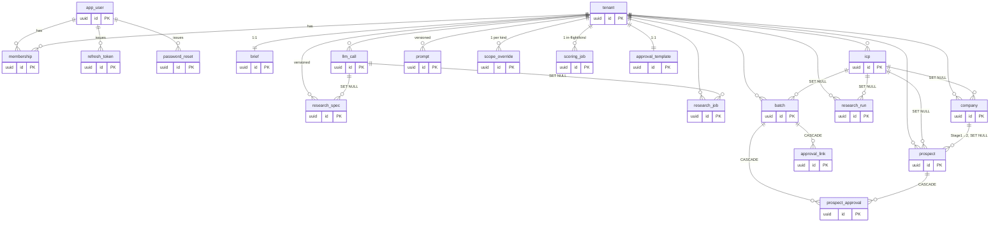

# HoldSlot — Data Schema (Apollo + internal database)

> ⭐ **This is the single source of truth for ALL data schema across the whole HoldSlot product** — every
> internal Postgres (Aurora) table plus the Apollo API field contract, all phases, built or planned. If
> any other doc (incl. [`initial-build-plan.md`](initial-build-plan.md) /
> [`backend-development-plan.md`](backend-development-plan.md)) shows a table or column differently, **this
> doc wins**, and schema changes are recorded **here first**.
>
> **A–D are LIVE** (verified against [`apps/api/app/models.py`](../apps/api/app/models.py) + the Alembic
> migrations **through `0027` applied to dev** — verified
> 2026-07-11, final pre-production review (`0027` deployed at push #1)). C is the **Apollo-only**
> find → score → select → enrich loop (see [`initial-build-plan.md`](initial-build-plan.md) → Phase C); the
> 2026-06-25 modularization + W0–W8 pass added the perf indexes + `prospect.fit_reason` (`0014`) and the
> `scoring_job` async ledger (`0015`); `scope_override` (`0012`) is also defined below.
>
> **D is LIVE** — migration `0016` **applied** to dev Aurora (verified 2026-07-01: head `0016`, all 4 tables
> present, 20 application tables). Phase D (S3 · Sendout batch + client approval) adds **4 tables** — `batch`,
> `prospect_approval` ⭐, `approval_link`, `approval_template` — the revenue precondition: a `prospect_approval`
> row is the billable agreement S7 charges against, written through a tokenized, expiring, **masked** approval
> link (see [`initial-build-plan.md`](initial-build-plan.md) → Phase D). *(20 tables · head `0027` as of
> that verification; now **30 tables · head `0031`** — see the Phase E/F/G callouts below.)*
>
> **Multi-ICP scoping (2026-07-06 → D+ Stage 4 2026-07-08)** — `research_spec.spec` is now **v6**:
> `icp_targeting[]` carries one Apollo targeting block per ICP, the intent DATE windows are removed
> (hiring titles only), and **`people_search_params.person_titles[]`** is added (D+ Stage 2 "Query =
> rubric": the query now sends the titles the fit rubric scores). D+ Stages 3 & 4 add no OUTPUT field
> (still v6) — only INPUT prompt blocks in Regenerate: `avoid_keywords[]` (Stage 3) +
> `keyword_yield[]` / `customer_anchors[]` (Stage 4). No table changes — `spec` is JSONB;
> `0017`/`0018`/`0020`/`0021`/**`0022`** are data-only (re-seed the `briefing` prompt
> `brief-structure-v6` → `v7` → `v8` → `v9` → **`v10`** for tenants still on a shipped default). The
> people relax ladder queries titles first (`titles_strict → titles_fuzzy`) then falls back to the two
> facets (`seniority×dept → seniority_only`). Stage 4 also emits the two Apollo tech-UID filters
> (`currently_using`/`currently_not_using_any_of_technology_uids`), resolved server-side by
> `prospects/tech_vocab` from `auth/supported_technologies_csv` (never model-emitted).
>
> **Phase E built + SHIPPED (2026-07-12).** The S4/S5 outreach tables (`campaign` · `message_variant` ·
> `campaign_lead` · `outreach_event`, **`0028`**) plus the per-tenant `sending_account` pool (**`0029`** —
> Smartlead inbox ids moved out of Secrets Manager into the DB) are **applied to dev Aurora**; backend
> **Lambda v86** (commit `d8aef2b` · Amplify dev job 55). The S6 booking/meeting tables (`booking_link` ·
> `meeting` · `feedback_link`, **`0030`**) are **built + SHIPPED to dev (2026-07-12)** — applied to dev
> Aurora, backend Lambda **v87** (commit `44b761b`); the F execution plan, FD-1…FD-8 defaults, and the
> per-step **test-case register** live in [`initial-build-plan.md`](initial-build-plan.md) → Phase F.
> Built head is now **`0031` · 30 tables** (`0031` Phase-G Stripe billing, dormant).
>
> **`0019` — scope lineage + probe/cursor telemetry (D+ alignment build) — APPLIED to dev 2026-07-08.**
> `research_run` gains **`filter_body`** JSONB (the exact executed Apollo body; find-people stores
> `{"per_org": {domain: {body, relax}}}`, ≤8 orgs/run) · **`scope_source`** varchar(16) (`ai` · `custom` ·
> `lookalike` · NULL for non-Apollo runs) · **`result_meta`** JSONB (`total_entries` · `breadcrumbs` echo ·
> `pages_fetched` · `relax_level` · `over_broad` · `apac` · `body_hash` · **Stage 3 page cursor:**
> `resume_page` · `page_cursor` · `total_pages` · `scope_exhausted` · `known_skipped`). The cursor is
> read back by `_resume_page` (scan latest same-`body_hash` run) — no new column. No other table changes. See
> [`initial-build-plan.md`](initial-build-plan.md) → *Prospect-scope alignment build (D+)*.

## The governing boundary

> **Apollo is a headless discovery + enrichment API. The HoldSlot DB is the only system of record.**

Apollo returns rows on a REST call (`mixed_companies/search`, `mixed_people/api_search`, `people/match`);
it stores nothing we depend on. Tenant ownership, dedup, suppression, fit scoring, lineage, and outreach
status all live in Postgres.

| | **Apollo (REST API)** | **HoldSlot DB (Aurora/Postgres)** |
|---|---|---|
| Nature | Stateless search + enrichment service | Durable system of record |
| State we keep | none — only Apollo ids (`apollo_org_id` / `apollo_person_id`) | every row |
| Knows tenants? | ❌ | ✅ `tenant_id` on every business row |
| Authoritative for | discovery + enrichment data only | everything else |

**Conventions (built tables):** PKs are `uuid` (`gen_random_uuid()`); `tenant_id` is a FK to `tenant`
(`ON DELETE CASCADE`) and **is the spec's `client_id`** (same value, two names); timestamps are
`timestamptz`; `created_at`/`updated_at` default to `now()` (`updated_at` via `onupdate`). Status fields
that may grow new values are **plain strings, not DB enums**, to avoid migrations.

---

# Part 1 — Apollo (headless discovery + enrichment API)

**Apollo is a REST service, not a durable store — there is no Apollo-side table to define.** HoldSlot calls
three endpoints and persists the results into Postgres (Part 2). Auth = header **`X-Api-Key`** from
`holdslot/prod/apollo` (`{"key": …}`). Requires **Apollo Professional + master API key**; on the free key
every Search/Match call 403s (`API_INACCESSIBLE`) — only `organizations/enrich` works.

### Endpoints (confirmed from Apollo docs + live-API deep research 2026-06-21)
| Purpose | Endpoint | Credits | Returns |
|---|---|---|---|
| Find Company | `POST /api/v1/mixed_companies/search` | **0 — FREE** (founder Apollo-dashboard confirm 2026-07-08; the public "charged per page" pricing doc does NOT apply to this Professional + master-key account). Search width is **not** a cost constraint — width is bound by the **async find worker's Lambda timeout** (Stage 1b `find-company-async`; `FIND_COMPANY_LIMIT` env, default 100), not credits | org rows (firmographics, `apollo_org_id`) |
| Find People | `POST /api/v1/mixed_people/api_search` | **0** | person rows, **no email/phone**; needs master key |
| Enrich | `POST /api/v1/people/match` | **1/email · 8/phone** | verified email/phone/provider for ONE person |

Never call legacy `/api/v1/mixed_people/search` (returns 422). Pagination: `per_page` (≤100) + `page`,
**Apollo hard cap 500 pages = 50k rows**, with 429 backoff. Phone reveal is **hardcoded off** (not an
env knob) — `match_person(..., reveal_phone=False)` — since phone is **async → requires a `webhook_url`**.

### Request-param contract (input side — `apollo_map` forwards `ResearchSpec` v6 params)
**v6 is Apollo-native:** the LLM emits the exact Apollo request fields by name, so `apollo_map` forwards
them with no vocabulary translation — it only merges server config (`credit_policy`) + the Flow-A→B
`organization_ids`. `⊘` = no Apollo request param → **DB-side post-filter** (see initial-build-plan → Phase C).

**Find Company (`mixed_companies/search`) ← `spec.company_search_params` + `spec.intent_filters.company`**
| Apollo request param | Type / vocabulary | source field |
|---|---|---|
| `q_organization_keyword_tags[]` | free-text keywords (industry/vertical — no industry-id field) | `company_search_params.q_organization_keyword_tags` |
| `organization_num_employees_ranges[]` | array of `"min,max"` strings | `company_search_params.organization_num_employees_ranges` |
| `organization_locations[]` | lowercase free text (country/US-state/city) | `company_search_params.organization_locations` |
| `revenue_range[min]` / `[max]` | int (plan-gated) | `company_search_params.revenue_range {min,max}` |
| `q_organization_job_titles[]` | free text | `intent_filters.company.q_organization_job_titles` (hiring signal — the funding/jobs-posted **date windows were removed in spec v5**; `map_company_filter` never forwards them) |
| `page` / `per_page` (≤100) | int | paginate to `credit_policy.max_companies` |

**Find People (`mixed_people/api_search`) ← `spec.people_search_params` + selected orgs**
| Apollo request param | Type / vocabulary | source field |
|---|---|---|
| `organization_ids[]` | Apollo org ids | **selected** `company.apollo_org_id` (Flow A→B scope link — required; empty ⇒ 400) |
| `person_titles[]` | free text, fuzzy | `people_search_params.person_titles` |
| `include_similar_titles` | bool | `people_search_params.include_similar_titles` |
| `q_keywords` | single string (industry/vertical for people) | `people_search_params.q_keywords` |
| `person_seniorities[]` | **fixed enum:** owner·founder·c_suite·partner·vp·head·director·manager·senior·entry·intern | `people_search_params.person_seniorities` |
| `person_department_or_subdepartments[]` | Apollo taxonomy enum (undocumented but **filters** — live A/B 2026-07-08) | `people_search_params.person_department_or_subdepartments` |
| `organization_locations[]` | free text (employer HQ) | `people_search_params.organization_locations` |
| `organization_num_employees_ranges[]` | array of `"min,max"` | `people_search_params.organization_num_employees_ranges` |
| `contact_email_status[]` | enum: verified·unverified·likely to engage·unavailable | `credit_policy.email_status_filter` (server-set) |
| `page` / `per_page` (≤100) | int | paginate to `credit_policy.max_people` |

> **⚠️ Verified against Apollo's official OpenAPI spec (2026-07-08) + what still needs live fixtures:**
> (1) the funding-**stage** filter (`organization_latest_funding_stage_cd[]`) is **not in the documented
> spec** — treat as unavailable; (2) `person_department_or_subdepartments` (which the code sends today) is
> **not a documented API param** — but the D+ Stage 1 live A/B (2026-07-08) confirmed it **FILTERS**, so
> the seniority×dept ladder rung is kept; (3) there is **no API title-exclude, no per-company cap, and no
> exclude-by-id/keyword/industry** — the only exclusion params are `organization_not_locations[]` +
> `currently_not_using_any_of_technology_uids[]` (negative filtering stays DB/pipeline-side → D+ Stage 3);
> (4) company-search credits **confirmed FREE (0 credits)** — founder Apollo-dashboard confirm 2026-07-08,
> the public "charged per page" pricing doc does not apply to this account; (5) `person_titles[]` is fuzzy
> by default — `include_similar_titles=false` gives strict matching (D+ Stage 2 adds titles to the people
> query); technologies have a canonical vocabulary at `auth/supported_technologies_csv` (D+ Stage 4 resolver).

### Company search → `company` row (`apollo_map.parse_company`, pure, fixture-tested)
| Apollo field | → our field |
|---|---|
| `organization.id` | `apollo_org_id` (upsert key; feeds Find People's `organization_ids`) |
| `name` | `name` |
| `primary_domain` / `website_url` | `domain` (normalized dedupe key) / `website` |
| `linkedin_url` | `linkedin_url` |
| `industry` | `industry` |
| `estimated_num_employees` | `size` |
| `city`/`state`/`country` | `country` (+ locality → `evidence`) |
| `annual_revenue`, `founded_year`, `technology_names`, `keywords` | → `evidence` JSONB |

### People search → `prospect` row (`parse_person`; email/phone NULL at this stage)
| Apollo field | → our field |
|---|---|
| `id` | `apollo_person_id` (upsert key; the `people/match` handle) |
| `name` | `enrichment.full_name` |
| `title` | `enrichment.title` |
| `seniority` | `enrichment.seniority` |
| `linkedin_url` | `enrichment.linkedin_url` |
| `organization.name` / `primary_domain` | `enrichment.company` / `enrichment.domain` |
| (searched org) | `company_id` linked directly (we know which `apollo_org_id` we queried) |

Apollo-found people get `identity_key = "apollo:<apollo_person_id>"` (the find-time key); the ladder
(LinkedIn slug → `domain\|last\|first` → email) applies to manual adds/enriched rows only. Either way it is
the dedupe key + future `person` FK seam. Email/phone stay NULL until enrich.

### Enrich (`people/match`) → fills the `prospect` contact fields (the heavy credit spend)
Run **only** on the human-selected set at gate 2. `match_person(apollo_person_id, reveal_email=true,
reveal_phone=False)` (phone **hardcoded off**, not an env knob). Phone (8 cr) is delivered
**asynchronously to a `webhook_url`**, not in the sync response — off at MVP, so the sync email path is all we wire:
| Apollo field | → our field |
|---|---|
| `email` | `enrichment.email` (+ normalized) |
| `email_status` (`verified`/…) | `email_valid` (truthy set) |
| `phone_numbers[]` | `enrichment.phone` (unused — phone reveal is hardcoded off) |
| `email`/provider source | `enrichment.provider` |

### Credit discipline (enforced in code)
1. **BOTH searches are FREE (0 credits) — founder-confirmed 2026-07-08.** Only `people/match` (enrich)
   spends. So width/pagination is unconstrained by cost; **never call `people/match` before gate 2** is the
   one hard credit rule. (Find-width is instead bound by the async find worker's Lambda timeout — D+ Stage 1b.)
2. **Exclusion / existing-customer filtering + all `⊘` post-filters are DB-side** (the `suppression.py`
   gate + result post-filter), not extra API calls.
3. **Dedup before enrich** on `apollo_person_id` / `identity_key` — a person already enriched is never
   re-matched (no double charge).
4. **Enrich only the selected set**; phone off by default (8× email cost + async webhook).

---

# Part 2 — Internal database

## Entity-relationship overview (30 tables · head `0031`)

Clusters: Identity/Tenancy (global), Phase B Targeting, Phase C Apollo find→enrich, the W4
async-scoring `scoring_job` ledger + the `scope_override` Find-Settings store, and **Phase D**
batch/approval (`batch`, `prospect_approval`, `approval_link`, `approval_template`). The ORM
([`apps/api/app/models.py`](../apps/api/app/models.py)) matches the migrations — **no drift**.
**Live:** Phase E campaign/outreach — 4 tables (`0028`) + `sending_account` (`0029`, per-tenant Smartlead
inbox pool) — **applied to dev Aurora 2026-07-11** (backend shipped v86, 2026-07-12). **Also live:** Phase F
booking/meeting/feedback — 3 tables (`0030`) — **applied to dev Aurora 2026-07-12** (backend v87, commit
`44b761b`); §below (the diagram shows pre-E built tables only).

```mermaid
erDiagram
    app_user      ||--o{ membership      : "has"
    tenant        ||--o{ membership      : "has"
    app_user      ||--o{ refresh_token   : "issues"
    app_user      ||--o{ password_reset  : "issues"
    tenant        ||--|| brief           : "1:1"
    tenant        ||--o{ icp             : ""
    tenant        ||--o{ llm_call        : ""
    tenant        ||--o{ research_spec   : "versioned"
    tenant        ||--o{ research_job    : ""
    tenant        ||--o{ company         : ""
    tenant        ||--o{ prospect        : ""
    tenant        ||--o{ research_run    : ""
    tenant        ||--o{ prompt          : "versioned"
    tenant        ||--o{ scope_override  : "1 per kind"
    tenant        ||--o{ scoring_job     : "1 in-flight/kind"
    tenant        ||--o{ batch           : ""
    tenant        ||--|| approval_template : "1:1"
    icp           ||--o{ company         : "SET NULL"
    icp           ||--o{ prospect        : "SET NULL"
    icp           ||--o{ research_run    : "SET NULL"
    icp           ||--o{ batch           : "SET NULL"
    llm_call      ||--o{ research_spec   : "SET NULL"
    llm_call      ||--o{ research_job    : "SET NULL"
    company       ||--o{ prospect        : "Stage1→2, SET NULL"
    batch         ||--o{ prospect_approval : "CASCADE"
    batch         ||--o{ approval_link   : "CASCADE"
    prospect      ||--o{ prospect_approval : "CASCADE"
    tenant { uuid id PK }
    app_user { uuid id PK }
    membership { uuid id PK }
    brief { uuid id PK }
    icp { uuid id PK }
    llm_call { uuid id PK }
    research_spec { uuid id PK }
    research_job { uuid id PK }
    company { uuid id PK }
    prospect { uuid id PK }
    research_run { uuid id PK }
    prompt { uuid id PK }
    scope_override { uuid id PK }
    scoring_job { uuid id PK }
    batch { uuid id PK }
    prospect_approval { uuid id PK }
    approval_link { uuid id PK }
    approval_template { uuid id PK }
    refresh_token { uuid id PK }
    password_reset { uuid id PK }
```

**Relationship notes:**
- **`tenant` is the spine** — every business table `ON DELETE CASCADE`s from it.
- Identity is global — `app_user` ↔ `tenant` is many-to-many via `membership`;
  `refresh_token`/`password_reset` hang off the user.
- `icp` and `llm_call` are soft refs (`SET NULL`) — deleting them orphans but doesn't destroy.
- **Two-stage flow** — `company` (Stage 1, dedup `domain`, Apollo via `apollo_org_id`) →
  `prospect` (Stage 2, dedup `identity_key`, via `company_id` + `apollo_person_id`).
  `prospect.last_enriched_at` is the seam for a future shared `person`/enrichment cache.
- Versioned config — `research_spec`, `prompt` (per tenant×stage), `research_run` (cost ledger) — append-only.
- `scope_override` (`0012`) and `scoring_job` (`0015`) are **operational ledgers**, not business entities:
  one `scope_override` per (tenant, kind); one in-flight `scoring_job` per (tenant, kind).
- **Phase D (`0016`)** — `batch` groups enriched `prospect` rows; each (prospect × batch) gets one
  append-only `prospect_approval` ⭐ (the billable record); `approval_link` is the tokenized expiring
  link (mirrors `password_reset`); `approval_template` is one sendout-copy doc per tenant (mirrors
  `brief`). `prospect_approval`/`approval_link` **CASCADE** from `batch`; counts are **derived**, never
  stored. The masked external serializer reads `prospect`+`company` but emits fit context only.

## Phase A (S0) — Identity & tenancy core ✅ BUILT
Migration `20260611_0001_baseline` (+ `0002_seed`). Identity tables are **global**; a user joins tenants
via `membership`. Today `tenant` holds exactly HoldSlot (#0); a paying client later is one `INSERT`.

### `tenant`
| Column | Type | Notes |
|---|---|---|
| `id` | uuid PK | |
| `slug` | varchar(63) **unique** | drives `holdslot.com/<slug>` |
| `name` | varchar(255) | |
| `status` | enum `tenant_status` (`active`/`suspended`) | |
| `created_at`, `updated_at` | timestamptz | |

### `app_user`
| Column | Type | Notes |
|---|---|---|
| `id` | uuid PK | |
| `email` | varchar(320) **unique** | stored lowercase (no citext) |
| `password_hash` | varchar(255) | argon2 |
| `full_name` | varchar(255) nullable | |
| `status` | enum `user_status` (`active`/`disabled`) | |
| `last_login_at` | timestamptz nullable | |
| `created_at`, `updated_at` | timestamptz | |

### `membership` — the tenant↔role join (build single, design multi)
| Column | Type | Notes |
|---|---|---|
| `id` | uuid PK | |
| `user_id` | uuid FK → `app_user` (CASCADE) | idx |
| `tenant_id` | uuid FK → `tenant` (CASCADE) | idx |
| `role` | enum `membership_role` (`owner`/`member`) | role is on the membership, not the user |
| `created_at` | timestamptz | |
| | | **unique(`user_id`,`tenant_id`)** |

### `refresh_token`
| Column | Type | Notes |
|---|---|---|
| `id` | uuid PK | |
| `user_id` | uuid FK → `app_user` (CASCADE) | idx |
| `token_hash` | varchar(64) **unique** | |
| `expires_at` | timestamptz | |
| `revoked_at` | timestamptz nullable | |
| `created_at` | timestamptz | |

### `password_reset`
| Column | Type | Notes |
|---|---|---|
| `id` | uuid PK | |
| `user_id` | uuid FK → `app_user` (CASCADE) | idx |
| `token_hash` | varchar(64) **unique** | |
| `expires_at` | timestamptz | |
| `used_at` | timestamptz nullable | one-click reset link flow |
| `created_at` | timestamptz | |

## Phase B (S1) — Targeting: Brief & ICP → ResearchSpec ✅ BUILT
Migrations `20260612_0003_phase_b_targeting` (+ `0004_icp_suggestions`). Form documents are **opaque
JSONB** (a form change is a frontend edit, never a migration); `research_spec` is the versioned search
contract (**v6**, Apollo-native), append-only, each linked to the `llm_call` that produced it.

### `brief` — one per tenant
| Column | Type | Notes |
|---|---|---|
| `id` | uuid PK | |
| `tenant_id` | uuid FK (CASCADE) | **unique per tenant**; idx |
| `data` | JSONB (default `{}`) | the opaque form document (incl. **`targetMarket`** = `B2B`/`B2C`/`Both`, which drives the company-fit market gate — no migration, a form field) |
| `created_at`, `updated_at` | timestamptz | |

### `icp` — many per tenant
| Column | Type | Notes |
|---|---|---|
| `id` | uuid PK | |
| `tenant_id` | uuid FK (CASCADE) | idx |
| `name`, `tag` | varchar(255) | card header |
| `data` | JSONB (default `{}`) | the opaque form document |
| `created_at`, `updated_at` | timestamptz | |

### `llm_call` — the one-seam LLM telemetry (append-only)
Written by the B3 OpenRouter adapter on **every** call; every later AI feature (fit scoring, sourcing,
recaps) writes through it.
| Column | Type | Notes |
|---|---|---|
| `id` | uuid PK | |
| `tenant_id` | uuid FK (CASCADE) | idx |
| `purpose` | varchar(64) | four live values: `brief_structure` · **`company_model`** (stage-0 B2B/B2C classifier) · `company_score_v2` · `prospect_score_v2`; idx |
| `model` | varchar(128) nullable | model actually served |
| `prompt_version` | varchar(64) nullable | the loop's instrument |
| `status` | varchar(32) | `ok`/`parse_error`/`timeout`/`error` (string, not enum) |
| `input_tokens`, `output_tokens` | int nullable | |
| `cost_usd` | numeric(14,8) nullable | OpenRouter usage/cost |
| `latency_ms` | int nullable | |
| `retries` | int (default 0) | |
| `raw` | JSONB nullable | raw completion — top debugging signal; parse failures recorded before retry |
| `created_at` | timestamptz | |

### `research_spec` — append-only versioned **v6** search contract (Apollo-native, per-ICP)

> **v5 (2026-07-06):** the intent DATE windows (`latest_funding_date_range`,
> `organization_job_posted_at_range`, `recency_window`) are **removed from the contract** — they
> always over-constrained the company search (founder verdict). Intent = hiring titles only.
> `apollo_map.map_company_filter` also refuses to forward the date fields from OLD stored specs /
> stale overrides, so they are dead everywhere. Prompt re-seeded to `brief-structure-v7` (`0018`).
| Column | Type | Notes |
|---|---|---|
| `id` | uuid PK | |
| `tenant_id` | uuid FK (CASCADE) | idx |
| `version` | int | **unique(`tenant_id`,`version`)**; re-run inserts the next version |
| `spec` | JSONB | **v6** targeting (icp_targeting[] — one block per ICP · icp_validation + server-merged credit policy). v3 rows (single merged block) remain readable via the `targeting_for_icp` fallback |
| `gaps` | JSONB (default `[]`) | value-loop prompts (`{field, why_it_matters, ask, icp_name}` — `icp_name` "" = whole-brief) |
| `icp_suggestions` | JSONB (default `[]`) | proposed ICPs from the existing-customer list (added `0004`) |
| `model` | varchar(128) nullable | |
| `llm_call_id` | uuid FK → `llm_call` (SET NULL) nullable | traces spec → exact model/cost/raw output |
| `created_at` | timestamptz | |

**`research_spec.spec` — the v6 JSON contract** (`spec_version = 6`; what the LLM emits + what
`apollo_map` forwards — fields are **exact Apollo request params**, full mapping in *Request-param
contract* above). The strict `json_schema` lives in
[`research_spec.py`](../apps/api/app/domains/briefs/research_spec.py); the workspace *Prospect Scope*
panel renders every field below for operator review, one section group per ICP.

- **`icp_targeting[]`** — **exactly ONE entry per ICP** (`icp_id`/`icp_name` echoed from the input
  and verified server-side by `reconcile_icp_targeting`; echo typos repaired by name, a missing ICP
  fails the job by name — the old v3 "second ICP silently merged/dropped" failure is contract-impossible).
  Each entry carries its own:
  - **`company_search_params`** — `q_organization_keyword_tags[]` · `organization_num_employees_ranges[]`
    (comma-strings `"10,100"`) · `organization_locations[]` (lowercase HQ) · `revenue_range{min,max}` (int)
  - **`people_search_params`** — `person_titles[]` (free text, fuzzy — D+ Stage 2 "Query = rubric") ·
    `include_similar_titles` (bool) · `q_keywords` (single string — industry/vertical for people) ·
    `person_seniorities[]` (**fixed enum:** owner·founder·c_suite·partner·vp·head·director·manager·
    senior·entry·intern) · `person_department_or_subdepartments[]` (Apollo taxonomy enum) ·
    `organization_locations[]` · `organization_num_employees_ranges[]`
  - **`intent_filters`** — `company{q_organization_job_titles[]}` (hiring signal only; the
    funding/jobs-posted date windows were removed in v5)
- **`icp_validation`** (analysis, NOT Apollo-bound — the paying-customer read from the brief's
  `excludeCustomers` list; brief-level, emitted ONCE) — `customer_profiles[]{name, domain, industry,
  employee_band, hq_country, business_model, source:"knowledge"|"web", confidence}` · `paying_customer_summary`
- **`credit_policy`** (deterministic **server config**, never LLM-set; merged at save time) —
  `email_status_filter` (default `["verified"]` → `contact_email_status`) · `phone` (default `false`) ·
  `max_companies` (500) · `max_people` (800)

**Consumption:** `targeting_for_icp(spec, icp_id)` is the ONE spec reader — find-company resolves
the chosen ICP's block (multi-ICP spec + no/unknown ICP → 400, never a silent merge); find-people
resolves each company's block from its own `company.icp_id` (a mixed selection searches ICP by ICP
in one call); fit scoring slices the scored row's own block into the v3 single-block shape the
rubrics read. A **v3 spec** (pre-multi-ICP, single merged block) answers any `icp_id` unchanged
until the next regenerate — no migration (`spec` is JSONB, append-only; same as the v2→v3 move).

`gaps` + `icp_suggestions` are separate columns (above) — value-loop signals, never folded into `spec`.
Each `icp_suggestions[]` entry is `{name, rationale, evidencing_customers[], confidence,
company_search_params{…}, people_search_params{…}}` — a ready-to-run ICP the operator can accept.
**Brief-side exclusions** (`excludeCustomers`/`excludeDeals`/`doNotContact`) feed suppression directly
from the brief text (not the spec) — the spec emits no `exclusions` block.

### `research_job` — async structuring job tracker (`0009`)
Scoping runs **DeepSeek V4 Pro** (thinking + web-search plugin, ~55-76s) — past the API Gateway
HTTP-API hard 30s cap. So `POST /brief/structure` inserts a `queued` row and fires a background
worker (Lambda **self async-invoke**; a thread in local dev) that runs the LLM, inserts the next
`research_spec` version, and flips this row terminal. The UI polls `GET /brief/structure/status`.
One in-flight job per tenant (a queued/running job is returned as-is) so a double-click can't double-spend —
now DB-enforced by the partial UNIQUE `uq_research_job_active_tenant` on (`tenant_id`) `WHERE status IN
('queued','running')` (`0027`, N8; no `kind` column — one structuring surface per tenant): a concurrent
double-POST hits IntegrityError and `enqueue_structuring` coalesces onto the winner.
| Column | Type | Notes |
|---|---|---|
| `id` | uuid PK | |
| `tenant_id` | uuid FK (CASCADE) | idx |
| `status` | varchar(16) (default `queued`) | `queued`→`running`→`done`\|`error` (string, not enum) |
| `spec_version` | int nullable | set on `done` — the `research_spec.version` produced |
| `error` | text nullable | set on `error` — short human-facing cause |
| `llm_call_id` | uuid FK → `llm_call` (SET NULL) nullable | the call that produced the spec |
| `created_at`, `updated_at` | timestamptz | |

## Phase C (S2) — Prospects: company-first, two-stage (Apollo find → enrich) ✅ BUILT & LIVE
Follows the same conventions; all carry `tenant_id` (= `client_id`), scoped by the A4 guard. **Built today:
`prospect` + `research_run` + `prompt` (created as `sourcing_doc` in `0005`, renamed `0010`), `company`
+ `prospect.company_id` (`0007`), `company.website` (`0008`), `research_job` async-structuring tracker
(`0009`, Phase B). The Apollo rebuild adds `0011`: `company.apollo_org_id` + `prospect.apollo_person_id`, and **drops**
`tenant.seed_limit` (`0006`, AI-loop seed anchoring — removed). The C8–C10 + W0–W8 deltas add `scope_override`
(`0012`), the `company_fit`/`prospect_fit` rubric split (`0013`), the hot-read composite indexes +
`prospect.fit_reason` (`0014`), and the `scoring_job` async ledger (`0015`).
The two SCALE tables (`person` / `enrichment_request`) are the additive multi-tenant step, not built.**

> **Hot-read indexes:** the `/{client}/prospects` + `/{client}/companies` list feeds sort
> `score_total DESC NULLS LAST, created_at DESC, id DESC` (label-agnostic), so `prospect` and `company`
> each carry a `(tenant_id, score_total DESC NULLS LAST, created_at DESC)` composite matching it
> (`ix_prospect_tenant_score` / `ix_company_tenant_score`, D+.5 `0027`) — the hottest read returns rows
> pre-ordered (W5 cursor pagination adds the `id` tiebreak). A second `(tenant_id, label, score_total DESC
> NULLS LAST, created_at DESC)` composite (`ix_*_tenant_label`, scoring v2 `0024`) serves label-filtered
> reads. The v1 `ix_*_tenant_fit` (`fit_score`) indexes were dropped in `0026` (V2-4); the composite-covered
> single-column `ix_company_tenant_id`/`ix_prospect_tenant_id` were dropped in `0027`. Four other redundant
> single-column indexes were dropped in `0014` (`ix_company_domain`, `ix_prospect_identity_key`,
> `ix_brief_tenant_id`, `ix_scope_override_tenant_id` — each covered by a UNIQUE constraint's index).
> `research_run` carries `ix_research_run_tenant_created` (`tenant_id, created_at DESC`, `0027`) for the
> find-history + Stage-3 resume scans; its prefix-covered `ix_research_run_tenant_id` was dropped in `0027`
> (N49).

### Phase C end-to-end flow (Apollo, programmatic — two gates, no CSV)
The objective is two gates: **(1) find companies likely to buy, (2) find the right person at each.**
Division of labor — **`apollo_map`** (pure, deterministic) forwards the Apollo request from the v6 spec; the
**LLM** only fit-scores; **Apollo** searches + enriches; **DB** is the system of record. No operator, no CSV:

1. **Find Company** — `apollo_map.map_company_filter(spec.company_search_params, spec.intent_filters)` → Apollo
   `mixed_companies/search` (**0 credits** — search is free) → DB-side post-filter + exclusion drop → upsert on
   `apollo_org_id` → batched **company fit-score** → `company` rows (`discovered`).
2. **Gate 1** — user reviews/selects (`PATCH companies/select` → `selected`); may **manually add** a
   company (same schema, `source=manual`).
3. **Find People** — `apollo_map.map_people_filter(spec.people_search_params, org_ids=selected)` → Apollo
   `mixed_people/api_search` (0 cr, no email) → DB-side post-filter + exclusion drop → upsert on
   `apollo_person_id`, link `company_id` directly → batched **person fit-score** → `prospect` rows
   (`found`, unenriched).
4. **Gate 2 (enrich gate)** — user reviews scores and **confirms who to enrich** through the merged Reveal
   & score door (`POST /{client}/prospects/enrich-score-async` — the sync enrich route was deleted in
   D+.5/R10); may **manually add** a person (same schema, `source=manual`).
5. **Enrich** — Apollo `people/match` on the confirmed set only (1 credit/email; phone off by default) →
   `enrichment.email`/`email_valid`/`phone`/`provider`, re-scored → `scored`.
6. **Create batch** — group enriched prospects → Phase D approval (the real `batches` table is Phase D).

**Credit discipline:** **both searches are 0 credits** (founder-confirmed 2026-07-08); only the gate-4
confirmed set spends at `people/match`. Suppression/exclusions + `⊘` post-filters apply DB-side on every
search.

### `company` ✅ MVP (`0007`) — stage-1 discovery, per-(domain × tenant)
| Column | Type | Notes |
|---|---|---|
| `id` | uuid PK | |
| `tenant_id` | uuid FK (CASCADE) | idx |
| `icp_id` | uuid FK → `icp` (SET NULL) nullable | which ICP sourced it |
| `run_id` | uuid/str nullable | = `research_run.run_id` (the find run) |
| `apollo_org_id` | varchar nullable | Apollo org id (`0011`); upsert key + feeds Find People's `organization_ids`; **unique per tenant** |
| `domain` | varchar | dedupe key; **unique(`tenant_id`,`domain`)** (the standalone idx was dropped in `0014`) |
| `website` | varchar nullable | raw company URL (`0008`); `domain` stays the normalized dedupe key |
| `linkedin_url` | varchar nullable | company LinkedIn |
| `name` | varchar | |
| `industry`, `size`, `country` | varchar nullable | firmographics from Apollo company search |
| ~~`fit_score`~~ | — | **v1 — DROPPED in `0026` (V2-4)**; superseded by `score_total` |
| ~~`fit_tier`~~ | — | **v1 — DROPPED in `0026` (V2-4)**; superseded by `label` |
| `fit_reason` | text nullable | "why a fit" (client-facing); **scoring v2 reuses this column** for its `reason` enum-string |
| `label` | varchar(32) nullable | **scoring v2** (`0024`, spec [initial-build-plan.md §D+.2](initial-build-plan.md)) — the 4-label verdict `contact_now`/`contact_soon`/`low_fit`/`excluded_by_rules`; **NULL = "needs re-score"** (no backfill, decision ②). Index `(tenant_id, label, score_total DESC NULLS LAST, created_at DESC)` |
| `score_total` | int nullable | **scoring v2** — sum of the 4 subscores, 4–20 (≥16 `contact_now` · ≥10 `contact_soon` · else `low_fit`) |
| `fit_components` | JSONB (default `{}`) | rubric line-items + reason tags; the **`business_model`** label (`B2B`/`B2C`/`Complex`/`Unknown`) + `hq_country`/`has_b2b_line`, set by a **dedicated stage-0 classifier** (`company_model` purpose) at find/lookalike/manual-add time — BEFORE scoring. (The old `market_excluded` bool is gone — a market-gated company now carries the **`label = excluded_by_rules`** verdict directly, V2.) **Scoring v2** additionally stores `subscores` (`deal_fit`/`outbound_gap`/`trigger`/`reachability`), `flags[]`, `trigger_line`, `icp`, and the `liveness` verdict here. See Phase B/C + the D+ scoring-v2 addendum in [`initial-build-plan.md`](initial-build-plan.md) |
| `evidence` | JSONB (default `{}`) | citations / extras (revenue, employee count, locality) |
| `source` | varchar | `apollo` \| `manual` |
| `status` | varchar | `discovered` → `selected` → `people_found` (selection lives here — no separate `selected` column; `archived` reserved, never written) |
| `created_at` | timestamptz | |
| | | dedupe: re-import the same `domain` is idempotent |

### `prospect` ⬜ MVP — per-(identity × tenant) targeting record
| Column | Type | Notes |
|---|---|---|
| `id` | uuid PK | |
| `tenant_id` | uuid FK (CASCADE) | idx |
| `icp_id` | uuid FK → `icp` (SET NULL) nullable | which ICP sourced it |
| `company_id` | uuid FK → `company` (SET NULL) nullable | the company this person belongs to (two-stage link; resolved by domain on import) |
| `spec_version` | int nullable | `research_spec.version` used |
| `run_id` | uuid/str | = `research_run.run_id` (the find run) |
| `apollo_person_id` | varchar nullable | Apollo person id (`0011`); upsert key + the `people/match` handle; idx `ix_prospect_apollo_person_id` (`tenant_id`,`apollo_person_id`) (ORM) |
| `identity_key` | varchar | `apollo:<apollo_person_id>` (Apollo-found) or normalized LinkedIn / `domain\|last\|first` / email — **dedupe + future `person` FK seam** (the standalone idx was dropped in `0014`) |
| `enrichment` | JSONB | raw Apollo search/match row; no S3 at MVP volume |
| `email_valid` | bool | |
| ~~`fit_score`~~ | — | **v1 — DROPPED in `0026` (V2-4)**; superseded by `score_total` |
| ~~`fit_tier`~~ | — | **v1 — DROPPED in `0026` (V2-4)**; superseded by `label` |
| `fit_components` | JSONB | **scoring v2** stores the persona `subscores` (`persona_fit`/`authority`/`trigger`/`reachability`) + `flags[]` + `reason` here |
| `fit_reason` | text nullable | "why a fit" client-facing copy; **scoring v2 reuses this column** for its `reason` (`0014`, parity with `company.fit_reason`) — populated on next rescore, no backfill |
| `label` | varchar(32) nullable | **scoring v2** (`0024`) — same 4-label verdict, **extrapolated** from the company label + the person's own persona axes (no per-person web call); the company label **caps** the person's. NULL = "needs re-score" |
| `score_total` | int nullable | **scoring v2** — sum of the 4 persona axes, 4–20 |
| `source` | varchar | `apollo` \| `manual` (origin, not transport) |
| `source_lineage` | JSONB | run + rubric version |
| `status` | varchar | `found`→`confirmed`(to enrich)→`scored` · `enrich_failed` (written on match failure) (string, not enum); server default `found` (was `new`, changed in `0026`) |
| ~~`outreach_outcome`~~ | — | **DROPPED in `0026` (V2-4)** — never written/read (Phase-C placeholder) |
| `last_enriched_at` | timestamptz nullable | TTL-gates re-enrichment (~90d) + future `person` FK seam |
| `created_at` | timestamptz | |
| | | dedupe: re-import the same `identity_key` is idempotent |

### `research_run` ⬜ MVP — one per find run (company or people)
| Column | Type | Notes |
|---|---|---|
| `id` | uuid PK | |
| `tenant_id` | uuid FK (CASCADE) | idx |
| `run_id` | uuid/str **unique** | the find-run handle |
| `spec_version` | int nullable | |
| `icp_id` | uuid FK → `icp` nullable | |
| `source` | varchar | `apollo` · `lookalike` · `rescore` · `enrich` |
| `prompt_version`, `rubric_version` | varchar nullable | which spec (`brief-structure`) / score-rubric (`company_score`/`prospect_score`) versions ran — `rubric_version` stamps `v{prompt.version}` of the actually-loaded prompt row, fallback `score-rubric-v1` |
| `rows_pushed`, `rows_accepted` | int | the run's scoreboard (found / scored) |
| `cost_usd` | numeric nullable | LLM spend → per-run $/accepted (Apollo enrich-credit cost not stored — reconcile from the Apollo dashboard) |
| `filter_body` ⬜ `0019` | JSONB nullable | the **executed** Apollo request body (override-proof lineage); find-people stores `{"per_org": {domain: {body, relax}}}`, ≤8 orgs/run |
| `scope_source` ⬜ `0019` | varchar(16) nullable | `ai` · `custom` (any operator-supplied params) · `lookalike` · NULL for non-Apollo runs |
| `result_meta` ⬜ `0019` | JSONB nullable | search-response signal + cursor telemetry, captured off the fetch response (no extra Apollo call): `total_entries` · `breadcrumbs` echo · `pages_fetched` · `relax_level` · filter-body hash + **page cursor** (repeat find with an unchanged body resumes at the next page — D+ Stage 3) |
| `created_at` | timestamptz | |

### `prompt` ⬜ MVP — append-only per-client prompt store (renamed from `sourcing_doc`, `0010`)
The single home for every client-editable prompt, versioned per `(tenant, stage)`; the latest
version is active. (Was `sourcing_doc` with a `kind` column — renamed once it grew past sourcing.)
| Column | Type | Notes |
|---|---|---|
| `id` | uuid PK | |
| `tenant_id` | uuid FK (CASCADE) | idx |
| `stage` | varchar(32) | `briefing` (Brief→ResearchSpec scoping) · **`company_score`** / **`prospect_score`** (the scoring-v2 axis rubrics, seeded `0025`) · `company_fit` / `prospect_fit` (the v1 rubrics — kept through the cutover, split from `fit_scoring` in `0013`) · ~~`sourcing`~~ (legacy — the retired rows were **purged in `0027`**) |
| `version` | int | **unique(`tenant_id`,`stage`,`version`)**; append-only |
| `body` | text | seed v1 from `docs/prompts/*.md` in the migration (`briefing`←`brief-structure-v5.md`; `company_fit`/`prospect_fit`←`fit-scoring-rubric-v1.md` via the `0005`→`0010`→`0013` chain) |
| `created_at` | timestamptz | |

The briefing prompt is read DB-first by the scoping worker; if absent it falls back to the code
default (`DEFAULT_SYSTEM_PROMPT`, the Lambda bundle has no `docs/`). Saving in the UI appends the
next `briefing` version; an empty save resets to the default text.

### `scope_override` ✅ MVP (`0012`) — persisted Find-Settings override, one row per (tenant, kind)
The Step-2 *Find People · who to target* facets (Management Level × Department) were a per-browser
localStorage override; this moves them server-side so a saved tuning survives reloads/devices and a stale
local entry can't silently shadow the AI scope. Single-row **UPSERT** per kind; deleting the row reverts to
the `research_spec` scope. Both kinds are live (U1): `people` (Step-2 facets) AND `company` (Step-1).
`params` is a per-ICP map keyed `by_icp` (icp_id → params, `"*"` = global); precedence at find time =
request body → per-ICP override → AI spec. See [`initial-build-plan.md`](initial-build-plan.md) → Phase C → C9.
| Column | Type | Notes |
|---|---|---|
| `id` | uuid PK | |
| `tenant_id` | uuid FK (CASCADE) | **unique(`tenant_id`,`kind`)** (`uq_scope_override_tenant_kind`) |
| `kind` | varchar(16) | `people` (Step-2 facets) · `company` (Step-1) — both live (U1) |
| `params` | JSONB (default `{}`) | per-ICP map `{"by_icp": {"<icp_id>": {…}, "*": {…}}}` merged over `research_spec` at find time (request body → per-ICP override → AI spec) |
| `created_at`, `updated_at` | timestamptz | `updated_at` kept fresh by the `set_updated_at()` trigger (attached in `0014`) under raw UPSERT |

### `scoring_job` ✅ MVP (`0015`, W4) — async fit-scoring job ledger, one in-flight per (tenant, kind)
The six scoring-bearing surfaces (find-company, find-lookalikes, company/prospect rescore, Reveal & score
enrich, company field-refresh) fan out one fit LLM call per row; a large batch exceeds the API Gateway 30s cap and the
prior client-driven chunk loop died if the tab closed. So scoring moved **async**: a `…-async` kick-off
endpoint inserts a `queued` row and fires a background worker (Lambda self async-invoke; a thread locally)
that flips it `running`→`done`/`error` and records per-run counts on `result`. Mirrors `research_job`
(`0009`); a **job ledger**, not a business entity. `ASYNC_BATCH_MAX = 15`. Poll `GET /{client}/scoring-jobs/{job_id}`.
See [`initial-build-plan.md`](initial-build-plan.md) → *Modularization + W0–W8* (W4).
| Column | Type | Notes |
|---|---|---|
| `id` | uuid PK | |
| `tenant_id` | uuid FK (CASCADE) | idx `ix_scoring_job_tenant_kind` on (`tenant_id`,`kind`); single in-flight per kind — now DB-enforced by the partial UNIQUE `uq_scoring_job_active_tenant_kind` on (`tenant_id`,`kind`) `WHERE status IN ('queued','running')` (`0027`, R9): a concurrent double-POST hits IntegrityError and coalesces onto the winner |
| `kind` | varchar(32) | which scoring surface (`find_company`/`find_lookalikes`/`rescore_companies`/`rescore_prospects`/`enrich_score_prospects`/`update_fields`) |
| `params` | JSONB (default `{}`) | the original request body |
| `status` | varchar(16) (default `queued`) | `queued`→`running`→`done`\|`error` (string, not enum) |
| `result` | JSONB (default `{}`) | per-run counts (scored/failed) |
| `error` | text nullable | set on `error` |
| `created_at`, `updated_at` | timestamptz | `updated_at` via ORM `onupdate` (no trigger needed) |

## Phase D (S3) — Sendout batch & client approval ✅ BUILT & LIVE (`0016` applied · Lambda v55)
The **revenue precondition**: group enriched Phase-C prospects into a `batch`, send the client a
tokenized, expiring, **masked** approval link, record each per-prospect decision as the append-only
`prospect_approval` row S7 bills against. Reuses A/B/C primitives wholesale — the password-reset
opaque-token pattern (`approval_link` mirrors `password_reset`), the SES `send_email()` adapter, the
`require_membership(owner)` guard, the per-router `_out()` serializers — so **no EventBridge, no async
worker, no new AWS resources** (expiry is checked on read, a send is one SES call). The masking
allow-list serializer (`domains/approvals`) is the anti-data-theft control: the public endpoint emits
**fit context only** (name+initial · company *descriptor* · title/seniority · fit reason), never a
clear-text identity/contact vector. Console surface = `domains/batches`; counts are **derived** from
`prospect_approval`, never stored. See [`initial-build-plan.md`](initial-build-plan.md) → Phase D.

### `batch` ✅ (`0016`) — one sendout batch per group of enriched prospects
| Column | Type | Notes |
|---|---|---|
| `id` | uuid PK | |
| `tenant_id` | uuid FK (CASCADE) | idx `ix_batch_tenant_created` (tenant_id, created_at DESC) — the list ORDER BY |
| `icp_id` | uuid FK → `icp` (SET NULL) nullable | inferred from the prospects' shared ICP (when they agree) |
| `name` | varchar(255) | auto-named `Batch N` when omitted |
| `status` | varchar(32) (default `draft`) | `draft` → `sent` → `approved` \| `changes_requested` (string, not enum) |
| `sent_at` | timestamptz nullable | first send (kept on Follow-Up resends) |
| `decided_at` | timestamptz nullable | set when the client (or the step-3 manual fallback) decides |
| `created_at` | timestamptz | |
| | | total/approved/removed/pending counts are **DERIVED** from `prospect_approval`, never stored |
| | | a decided batch is **final** — both decide paths 409/410 a re-decide so the client's recorded choices can't be overwritten |

### `prospect_approval` ⭐ (`0016`) — the billable record, one append-only row per (prospect × batch)
| Column | Type | Notes |
|---|---|---|
| `id` | uuid PK | the opaque external decide handle (carries no identity) |
| `tenant_id` | uuid FK (CASCADE) | idx `ix_prospect_approval_tenant_id` (Phase E / billing reads) |
| `batch_id` | uuid FK → `batch` (CASCADE) | covered by the unique key's leftmost prefix (no separate idx) |
| `prospect_id` | uuid FK → `prospect` (CASCADE) | |
| `decision` | varchar(32) (default `pending`) | `pending` → `approved` \| `removed` (`request_changes` is a batch-level status) |
| `decided_at` | timestamptz nullable | |
| `created_at` | timestamptz | |
| | | **unique(`batch_id`,`prospect_id`)** (`uq_prospect_approval_batch_prospect`); **append-only** — "removed" is a value, never a delete |

### `approval_link` ✅ (`0016`) — tokenized expiring approval link (mirrors `password_reset`)
| Column | Type | Notes |
|---|---|---|
| `id` | uuid PK | |
| `tenant_id` | uuid FK (CASCADE) | |
| `batch_id` | uuid FK → `batch` (CASCADE) | idx `ix_approval_link_batch_id` (resend ladder finds a batch's links) |
| `recipient_email` | varchar(320) | the client contact the link was emailed to |
| `token_hash` | varchar(64) **unique** | SHA-256; the raw `secrets.token_urlsafe` token lives ONLY in the emailed URL |
| `expires_at` | timestamptz | validity checked **on read** (no scheduler); 7-day lifetime |
| `used_at` | timestamptz nullable | single-use |
| `created_at` | timestamptz | |
| | | resend **expires any prior live link** then mints a fresh row (only the latest send works — a mistyped earlier recipient is revoked); a decided `batch.status` makes EVERY link read `used`, and `decide` claims its link with an atomic `UPDATE … WHERE used_at IS NULL` (no double-decide / replay) |

### `approval_template` ✅ (`0016`) — one sendout-copy doc per tenant (mirrors `brief`)
| Column | Type | Notes |
|---|---|---|
| `id` | uuid PK | |
| `tenant_id` | uuid FK (CASCADE) | **unique(`tenant_id`)** (`uq_approval_template_tenant`) |
| `data` | JSONB (default `{}`) | `{subject, body, cta}` with `{{client_name}}`/`{{count}}` tokens; a code default serves until edited |
| `created_at`, `updated_at` | timestamptz | `updated_at` via ORM `onupdate` |

### Masking allow-list (the `GET /approve/{token}` serializer — D's security core)
The external (token-only, no-auth) view emits **exactly** these and nothing else (an allow-list, not a
deny-list — a new field can never leak): first name + last initial (from `enrichment.full_name`),
company *descriptor* (`company.industry`/`size`/`country`, **not** the exact name/domain),
title·seniority, `prospect.fit_reason` (the client-facing "why a fit"; the v1 `fit_tier` it also showed
was dropped in `0026`/V2-4), plus batch name/live count/client name/`expires_at`/
state (`valid`/`expired`/`used`) — and for an **expired/used** link, ONLY `state`+`expires_at` (no
client/batch name, so a forwarded stale link can't reveal tenant existence). **Withheld:** email, phone,
**LinkedIn URL**, full last name, exact company name+domain, `fit_components`, and any verified-presence
badge. `mask_name` also defends in depth — an "@"-bearing value (an email mistaken for a name) is
reduced to its local-part name tokens, never echoed whole. (Post-booking reveal = Phase F.)

## Phase E (S4/S5) — Campaign & outreach 🟢 LIVE + SHIPPED (`0028` + `0029` applied to dev Aurora 2026-07-11; backend Lambda v86, commit `d8aef2b`, 2026-07-12)
One expand migration (migrate-first). Design rules carried forward from A–D: statuses are **plain strings,
never DB enums**; counts/metrics are **derived from the event ledger, never stored** (the Phase-D
derived-counts rule); **`campaign_lead.stage` is the funnel's single source of truth** — Smartlead webhook
events are inputs to it, never the record; and the **billable-evidence chain stays explicit at every hop**:
`prospect_approval` (D) → `campaign_lead.approval_id` (E) → `meeting.approval_id` (F). Full behavior spec →
[`initial-build-plan.md`](initial-build-plan.md) → Phase E.

### `campaign` ⬜ (`0028`) — one per approved batch
| Column | Type | Notes |
|---|---|---|
| `id` | uuid PK | |
| `tenant_id` | uuid FK (CASCADE) | idx |
| `batch_id` | uuid FK → `batch` (**RESTRICT**) | **unique** — 1:1 with an *approved* batch (create 409s otherwise, idempotent on re-POST). RESTRICT makes a campaign-bearing batch **undeletable** (the D `DELETE /batches/{id}` cascade stops here) |
| `icp_id` | uuid FK → `icp` (SET NULL) nullable | copied from the batch |
| `name` | varchar(255) | defaults from the batch name |
| `smartlead_campaign_id` | varchar(64) nullable | set by the launch worker; **unique(`tenant_id`,`smartlead_campaign_id`)** |
| `status` | varchar(32) (default `draft`) | `draft` → `launching` → `sending` ⇄ `paused` → `completed` \| `error`. **`launching` doubles as the async-launch job state** — stale `launching` older than 480s (`MAX_JOB_AGE_SECONDS`) flips `error` on read: the `scoring_job` reaper semantics with **no separate job table** |
| `settings` | JSONB (default `{}`) | schedule / timezone / daily cap / `sl_setup_done` flag — opaque to the DB (the Brief JSONB rule). **Sending-inbox ids are NOT here** — they moved out of the secret to the tenant-scoped `sending_account` table (`0029`) |
| `created_at`, `updated_at` | timestamptz | |

### `message_variant` ⬜ (`0028`) — A/B/C copy per campaign
| Column | Type | Notes |
|---|---|---|
| `id` | uuid PK | |
| `tenant_id` | uuid FK (CASCADE) | |
| `campaign_id` | uuid FK → `campaign` (CASCADE) | |
| `key` | varchar(8) | `A` / `B` / `C` — **unique(`campaign_id`,`key`)** |
| `subject`, `body` | varchar(255) / text | the sequence copy pushed to Smartlead |
| `is_winner` | bool (default false) | manual toggle (E6) |
| `created_at`, `updated_at` | timestamptz | |
| | | open/reply rates are **DERIVED** from `outreach_event`, never stored |

### `campaign_lead` ⬜ (`0028`) — the funnel SoT, one per (campaign × prospect)
Rows are **inserted by the launch worker only as each Smartlead lead-add succeeds** (stage `contacted`) —
the funnel never shows a lead that wasn't actually pushed, and re-launch resumes idempotently on the
missing rows (approved prospects minus existing `campaign_lead`s).
| Column | Type | Notes |
|---|---|---|
| `id` | uuid PK | |
| `tenant_id` | uuid FK (CASCADE) | idx |
| `campaign_id` | uuid FK → `campaign` (CASCADE) | **unique(`campaign_id`,`prospect_id`)** |
| `prospect_id` | uuid FK → `prospect` (CASCADE) | |
| `approval_id` | uuid FK → `prospect_approval` (**no cascade**) | ⭐ the billable-evidence hop — the approval row that authorized contacting this person; undeletable while referenced (and its batch is RESTRICTed by `campaign` anyway) |
| `smartlead_lead_id` | varchar(64) nullable | Smartlead's handle (reply-to-thread + stats correlation) |
| `stage` | varchar(16) (default `contacted`) | **the funnel SoT** — vocabulary locked to the FE mock's `SAMPLE_FUNNEL` ids: `contacted` · `followup` · `replied` · `meeting` · `noshow` · `billable` · `drop`. Moves only through the server allowed-moves map (mirror of the FE `MOVES` table; illegal = 409); every move also writes a `stage_moved` event. E writes the first four; F writes `meeting`/`noshow`/`billable` |
| `stage_changed_at` | timestamptz | |
| `variant_key` | varchar(8) nullable | per-lead variant if Smartlead reports it (E0 verifies); else NULL and variant metrics stay event-derived |
| `created_at` | timestamptz | |

### `outreach_event` ⬜ (`0028`) — append-only outreach ledger (+ reply-queue workflow)
The single source for the per-lead log timeline, the variant scoreboard, and the Reply queue. Webhook
ingest is `INSERT … ON CONFLICT (smartlead_event_id) DO NOTHING` — the dedupe **is** the partial unique.
| Column | Type | Notes |
|---|---|---|
| `id` | uuid PK | |
| `tenant_id` | uuid FK (CASCADE) | idx `ix_outreach_event_tenant_type_created` (`tenant_id`,`event_type`,`created_at DESC`) — queue + scoreboard scans |
| `campaign_id` | uuid FK → `campaign` (CASCADE) | |
| `campaign_lead_id` | uuid FK → `campaign_lead` (SET NULL) nullable | an event can arrive for an unknown/removed lead — stored anyway, never 5xx'd back at Smartlead |
| `event_type` | varchar(32) | webhook kinds `email_sent` · `lead_replied` · `lead_opened` · `lead_clicked` · `lead_bounced` · `lead_unsubscribed` + internal `campaign_started` · `campaign_paused` · `stage_moved` · `reply_sent` (string, grows without migration). **Internal normalized names** — Smartlead's provider strings (`EMAIL_SENT`/`EMAIL_REPLY`/`EMAIL_BOUNCE`/…, naming drifts across their own docs) map in via E4's `_normalize_event()`; the raw provider name stays in `payload` |
| `smartlead_event_id` | varchar(128) nullable | **partial UNIQUE `WHERE smartlead_event_id IS NOT NULL` — the webhook idempotency key**; NULL on internal events. **Smartlead documents no unique event id (verified 2026-07-11)** — the key is the provider event id if the E0 probe finds one in real payloads, else a derived hash `sha256(campaign_id · to_email · event_type · sequence_number · provider_ts)` computed at ingest |
| `payload` | JSONB (default `{}`) | the raw webhook / internal detail; `lead_replied` keeps **`reply_message_id`** here (the reply-to-thread handle, risk R4) |
| `triage` | varchar(32) nullable | reply-queue class on `lead_replied` rows (mock vocabulary as strings: positive / objection-timing / referral / nudge / …) |
| `handled_at` | timestamptz nullable | queue done-state; **pip = `lead_replied AND handled_at IS NULL`** |
| `response_body` | text nullable | the operator's threaded reply as actually sent (paired with a `reply_sent` event) |
| `occurred_at` | timestamptz | provider timestamp (fallback `now()`); **parsed UTC-pinned** (the R16 lesson) |
| `created_at` | timestamptz | |

### `sending_account` 🟢 (`0029`) — per-tenant Smartlead sending-inbox pool
Moved out of the shared `holdslot/prod/smartlead` secret into the DB (founder decision 2026-07-11, "even
for MVP"). **An inbox id is a reference, not a credential** — the shared `api_key` stays the one secret;
the tenant→inbox mapping is config that grows per client, so a new client's inboxes are one INSERT, not a
global-secret edit + Lambda cache-bust + redeploy. The launch worker reads this tenant's `active` rows
(`active_sending_account_ids`) and attaches them via `add_email_accounts` — replacing the old
`sl.sending_account_ids()` secret read. Seeded for tenant #0 (`holdslot`: `20084486`, `20084475`) by `0029`.
| Column | Type | Notes |
|---|---|---|
| `id` | uuid PK | |
| `tenant_id` | uuid FK (CASCADE) | idx `ix_sending_account_tenant` |
| `smartlead_account_id` | bigint | the numeric id from Smartlead `GET /email-accounts`; **unique(`tenant_id`,`smartlead_account_id`)** (an inbox backs one tenant's pool) |
| `from_email` | varchar(320) nullable | display / audit |
| `from_name` | varchar(255) nullable | display / audit |
| `status` | varchar(16) (default `active`) | `warming` · `active` · `paused` — **only `active` inboxes are attached to a campaign** |
| `created_at`, `updated_at` | timestamptz | |

## Phase F (S6) — Booking, meeting & feedback 🟢 SHIPPED to dev (`0030` **applied** to dev Aurora 2026-07-12 — head `0030`, 3 tables + 7 `meeting` money columns verified; backend Lambda **v87**, commit `44b761b`; `f_smoke_live` green + `test_meetings_db` 2✓ + click-review browser 8/8 clean)
`booking_link` / `feedback_link` mirror `approval_link`/`password_reset` exactly: SHA-256 **`token_hash`**
only (raw token lives only in the sent URL) · validity checked **on read**, no scheduler · **atomic
single-use claim** (`UPDATE … SET used_at WHERE used_at IS NULL`). Feedback answers live **on `meeting`**
(1:1 — no separate feedback table). **`billable` is never stored** — derived on read as
`outcome = 'qualified' AND amount IS NOT NULL AND dispute_window_ends_at < now() AND NOT disputed`
(the 48-h window of backend-development-plan §7; **`amount` is stamped only when `approval_id` is
present** — no approval evidence, never billable; Stripe charges it at G). Behavior spec + the FD-1…FD-8
defaults + the per-step **test-case register** → [`initial-build-plan.md`](initial-build-plan.md) → Phase F.

**Semantics the columns rely on (locked with the F execution plan, 2026-07-12):**
- **No 4th table:** per-tenant availability windows live in **`brief.data.availability`** (opaque JSONB,
  the `targetMarket` precedent — FD-1): `{tz, meeting_minutes: 30, windows: {mon: [["10:00","18:00"]], …}}`;
  code default Mon–Fri 10:00–18:00 host TZ when absent.
- **`held`** (FD-2): true = a Meet conference record exists **with ≥2 participants**; `duration_min` =
  ceil(record `endTime − startTime` / 60). NULL = not yet ingested (the sweep's `WHERE held IS NULL`
  claim guard); false = no-show, decided only past a **24 h grace** after `scheduled_at` (FD-3).
- **Correlation key:** the Meet meeting code (the last path segment of `meet_link`, ==
  Calendar `conferenceData.conferenceId`) drives the Meet REST `space.meeting_code` records filter —
  no extra column needed; `conference_record_id` stores the resolved record handle.
- **`amount`** = `PER_MEETING_USD` (500), a module-level constant in `domains/meetings/service.py`
  (the `DEFAULT_DAILY_CAP` precedent), mirrored by the FE `lib/workspace/constants.ts` display const.

### `booking_link` 🟢 (`0030`, applied) — tokenized booking link, per replied lead
| Column | Type | Notes |
|---|---|---|
| `id` | uuid PK | |
| `tenant_id` | uuid FK (CASCADE) | |
| `campaign_lead_id` | uuid FK → `campaign_lead` (CASCADE) | idx — the resend ladder finds a lead's links |
| `token_hash` | varchar(64) **unique** | |
| `expires_at` | timestamptz | read-time validity; **7-day lifetime** (EF-Q6 — same TTL family as `approval_link`; no automated reminders, operator re-send is the reminder) |
| `used_at` | timestamptz nullable | single-use — claimed atomically at `POST /book/{token}` |
| `created_at` | timestamptz | |
| | | resend mirrors the approval ladder: revoke prior live links, mint fresh |

### `meeting` 🟢 (`0030`, applied) — the one row feeding funnel · ledger · recaps
| Column | Type | Notes |
|---|---|---|
| `id` | uuid PK | |
| `tenant_id` | uuid FK (CASCADE) | idx |
| `campaign_lead_id` | uuid FK → `campaign_lead` (SET NULL) nullable | nullable — a manual (non-funnel) meeting is allowed |
| `prospect_id` | uuid FK → `prospect` (SET NULL) nullable | |
| `approval_id` | uuid FK → `prospect_approval` (**no cascade**) nullable | ⭐ the billing-evidence **snapshot at booking time** — the qualify rule reads this, not a join-time lookup |
| `google_event_id` | varchar(128) nullable | Calendar event handle |
| `meet_link` | varchar(255) nullable | the join URL (Upcoming pane) |
| `scheduled_at` | timestamptz | stored UTC; rendered in viewer TZ |
| `conference_record_id` | varchar(128) nullable | Meet REST v2 handle (also the recap Recording link seed) |
| `held` | bool nullable | **NULL = not yet ingested** — the on-read poll's claim guard (`WHERE held IS NULL`, idempotent) |
| `duration_min` | int nullable | from Meet participants/records |
| `outcome` | varchar(16) nullable | `qualified` · `short_call` · `noshow` — the mock ledger's exact vocabulary (Qualified / Short call / No-show); derived ONCE at ingest; later change = explicit owner correction |
| `amount` | numeric(10,2) nullable | stamped **$500** on qualify (`PER_MEETING_USD`) — a computed amount, not a charge, until Stripe (G) |
| `dispute_window_ends_at` | timestamptz nullable | = meeting end + 48h, stamped at ingest; ledger chip **Held** inside the window, **Billed** (computed) past it |
| `disputed` | bool (default false) | a client dispute inside the window parks the row for operator review |
| `feedback_rating` | int nullable | 1–5 (the external feedback page's star scale) |
| `feedback_chips` | JSONB (default `[]`) | the chip strings as sent |
| `feedback_comment` | text nullable | |
| `feedback_at` | timestamptz nullable | ledger Feedback state: set = Received · live link = Pending · else None |
| `won` | bool nullable | the recap "Final conversion" (Deal won / No deal) — G, manual |
| `summary` | JSONB nullable | the deferred LLM `meeting_summary` lands here later ([SKIP→later]); recap detail renders pending until then |
| `created_at`, `updated_at` | timestamptz | |

### `feedback_link` 🟢 (`0030`, applied) — tokenized feedback link (post-meeting)
| Column | Type | Notes |
|---|---|---|
| `id` | uuid PK | |
| `tenant_id` | uuid FK (CASCADE) | |
| `meeting_id` | uuid FK → `meeting` (CASCADE) | idx |
| `token_hash` | varchar(64) **unique** | |
| `expires_at` | timestamptz | read-time validity |
| `used_at` | timestamptz nullable | single-use claim on submit |
| `created_at` | timestamptz | |

## Phase G (S7) — Stripe billing 🟢 SHIPPED dormant to dev (`0031` **applied** to dev Aurora 2026-07-12, head `0031`; backend Lambda **v89**; **billing gated on the GS0/FR-7 probe before the first real invoice**, GD-10)
The billing metering layer. **Pre-built per GD-10** (code + `0031` + doc-fixtures; the migration is now
applied and the code deployed, but **billing stays inert** until the founder's test-mode
`stripe_smoke_live.py` probe pins the live contract — the E0 pattern). **Ships dormant:** no tenant has a
`subscription` row (verified 0 rows on dev) until the first signup
(FR-7/FR-8), so the on-read billing sweep and the enrich-cap guard are both no-ops for tenant #0 today.
Built on **Stripe Billing Meters** (the legacy usage-records API is removed ≥ API version `2025-03-31.basil`;
the adapter pins the version header). Money rule stays the F one — `amount`/`is_billable`/`billing_chip` are
unchanged; GS only adds a **charge trigger** (`billed_at`) + the subscription/usage state. Behavior spec →
[`initial-build-plan.md`](initial-build-plan.md) → §GS.

- **The charge trigger:** the on-read billing sweep (rides F4's `sweep_meetings`) finds rows
  `is_billable(m) AND billed_at IS NULL AND` the tenant has an `active` subscription → emits **one meter
  event** (`event_name = qualified_meeting`, `identifier = meeting:{id}`, `value = 1`) → claims
  `UPDATE meeting SET billed_at = now() WHERE billed_at IS NULL`. Event-then-stamp is safe because the
  identifier dedupes a crash-retry (the GS0 verdict). `short_call`/`noshow`/`disputed`/no-subscription rows
  **never** emit; dogfood tenant #0 (no `subscription` row) is skipped.
- **The enrich-cap guard:** before the paid Apollo `people/match` dispatch (`_enrich_prospects`), the
  guard reads the tenant's `subscription` (none → unbounded no-op, today's behavior); past the plan cap it
  emits `enrichment_overage` meter events (`value = 1` each, price $3), **never a silent block** — a hard
  stop only when `overage_enabled = false` (§6 #7). Month rollover is an on-read `usage_month` check (no
  EventBridge, GD-2).

### `subscription` ⬜ (`0031`) — one billing row per paying tenant (tenant #0 has none — dogfood stays computed-only)
| Column | Type | Notes |
|---|---|---|
| `id` | uuid PK | |
| `tenant_id` | uuid FK (CASCADE) **unique** | one subscription per tenant |
| `plan` | varchar(16) | `free` · `launch` · `growth` (drives the default caps) |
| `stripe_customer_id` | varchar(64) nullable | `cus_…` |
| `stripe_subscription_id` | varchar(64) nullable | `sub_…` (carries the metered price item) |
| `activation_paid_at` | timestamptz nullable | the standalone $400 activation invoice paid (GD-9) |
| `enrichment_cap` | int | monthly Apollo `people/match` allowance (plan default; `admin_quota_override` wins) |
| `icp_limit` | int | max ICPs (plan default) |
| `current_month_usage` | int (default 0) | Apollo matches spent this `usage_month` |
| `usage_month` | varchar(7) nullable | `YYYY-MM` (UTC) — rollover resets `current_month_usage` on read |
| `admin_quota_override` | int nullable | founder override of `enrichment_cap` (support escape hatch) |
| `overage_enabled` | bool (default true) | true = over-cap bills via `enrichment_overage` meter; false = hard-stop at cap (§6 #7) |
| `status` | varchar(16) (default `active`) | mirrors Stripe: `active` · `past_due` · `canceled` · `incomplete` |
| `created_at`, `updated_at` | timestamptz | |
| | | `meeting.billed_at` (new col, `0031`) = the charge-emitted stamp; `is_billable`/`billing_chip` untouched |

### `billing_event` ⬜ (`0031`) — append-only Stripe webhook log + the idempotency store (GS5)
| Column | Type | Notes |
|---|---|---|
| `id` | uuid PK | |
| `tenant_id` | uuid FK (CASCADE) nullable | resolved off `stripe_customer_id`; NULL if unknown (still stored) |
| `stripe_event_id` | varchar(64) **unique** | `evt_…` — the dedupe key (a Stripe retry is a no-op, the `outreach_event` posture) |
| `type` | varchar(64) | `invoice.paid` · `invoice.payment_failed` · `customer.subscription.updated|deleted` |
| `payload` | JSONB | the raw verified event |
| `created_at` | timestamptz | |

### `person` ⬜ SCALE — tenant-AGNOSTIC enrichment cache (the enrich-once seam)
Built when the 2nd tenant lands. Lets a prospect wanted by N clients be enriched once (one Apollo
`people/match`, paid once) and referenced by N `prospect` rows.
| Column | Type | Notes |
|---|---|---|
| `identity_key` | varchar **PK** | the shared key |
| `email`, `phone`, `title`, `seniority` | varchar nullable | person enrichment |
| `company_domain`, `company_industry`, `company_size` | varchar nullable | company enrichment |
| `providers` | JSONB | enrich provenance (Apollo `people/match` source) |
| `last_enriched_at` | timestamptz | re-enrich TTL |
| `created_at`, `updated_at` | timestamptz | |
| | | on SCALE, `prospect` gains FK `identity_key` → `person` and drops the embedded `enrichment` |

### `enrichment_request` ⬜ SCALE — the fan-out + dedup-before-push map
| Column | Type | Notes |
|---|---|---|
| `id` | uuid PK | |
| `run_id` | uuid/str | |
| `identity_key` | varchar FK → `person` | |
| `tenant_id` | uuid FK (CASCADE) | which tenant(s) requested this identity |
| `requested_at` | timestamptz | |
| `status` | varchar | pending/enriched/skipped(cache-hit) |

---

## Migration history (Alembic, `infra/alembic/versions/`)
| Revision | Phase | Tables / change |
|---|---|---|
| `20260611_0001_baseline` | A | `tenant`, `app_user`, `membership`, `refresh_token`, `password_reset` |
| `20260611_0002_seed` | A | seed HoldSlot tenant #0 + two founder owners |
| `20260612_0003_phase_b_targeting` | B | `brief`, `icp`, `llm_call`, `research_spec` |
| `20260617_0004_icp_suggestions` | B | `research_spec.icp_suggestions` column |
| `20260619_0005_phase_c_prospects` ✅ | C | `prospect`, `research_run`, `sourcing_doc` (MVP) + seed `sourcing_doc` v1 (fit rubric only; the retired sourcing-prompt seed was dropped) for tenant #0 from `docs/prompts/*-v1.md` |
| `20260620_0006_tenant_seed_limit` ✅ | C | `tenant.seed_limit` — **dropped in `0011`** (AI-loop seed anchoring, retired) |
| `20260620_0007_phase_c_companies` ✅ | C | `company` (stage-1 discovery) + `prospect.company_id` (applied to dev) |
| `20260621_0008_company_website` ✅ | C | `company.website` (raw URL alongside the normalized `domain`) |
| `20260622_0009_research_job` | B | `research_job` (async Brief→ResearchSpec structuring tracker) |
| `20260622_0010_prompt_table` | B | rename `sourcing_doc`→`prompt`, `kind`→`stage` (`sourcing_prompt`→`sourcing`, `fit_rubric`→`fit_scoring`); seed `briefing` v1 from `brief-structure-v5.md` |
| `20260622_0011_apollo_ids` ✅ | C | `company.apollo_org_id`, `prospect.apollo_person_id`; **drop** `tenant.seed_limit` |
| `20260624_0012_scope_override` ✅ | C | `scope_override` — persisted Step-2 people-scope override (Find Settings saved server-side per tenant — see Phase C → C9) |
| `20260624_0013_split_fit_rubric` ✅ | C | split `prompt` stage `fit_scoring` → **`company_fit`** (Step 1) + **`prospect_fit`** (Step 2); rename existing rows to `company_fit`, seed `prospect_fit` from the same body (append-only, up/down clean — see Phase C → C10) |
| `20260625_0014_perf_indexes_fit_reason` ✅ | C (W1) | composite `(tenant_id, fit_score DESC NULLS LAST, created_at DESC)` indexes on `prospect`+`company`; **drop** 4 UNIQUE-covered single-col indexes; add `prospect.fit_reason`; attach `scope_override.updated_at` trigger. Reversible. |
| `20260625_0015_scoring_job` ✅ | C (W4) | `scoring_job` async fit-scoring job ledger + `ix_scoring_job_tenant_kind`; one in-flight per (tenant, kind) |
| `20260625_0016_phase_d_batch_approval` ✅ | D | `batch`, `prospect_approval` ⭐, `approval_link`, `approval_template` + indexes/unique keys (**applied to dev Aurora** — head `0016`, verified live) |
| `20260706_0017_brief_structure_v6` ✅(dev) | D+ | data-only `briefing` prompt re-seed: `brief-structure-v6` (multi-ICP `icp_targeting[]`) |
| `20260706_0018_brief_structure_v7` ✅(dev) | D+ | data-only `briefing` prompt re-seed: `brief-structure-v7` (spec v5 — intent date windows removed) |
| `20260708_0019_scope_lineage` ✅(dev) | C/D+ | `research_run.filter_body` + `scope_source` + `result_meta` — executed-body lineage + search-response signal + page-cursor telemetry (alignment build Stage 1) |
| `20260708_0020..0023_brief_structure_v8..v11` ✅(dev) | D+ | data-only `briefing` prompt re-seeds: `v8` (Stage 2 person_titles), `v9` (Stage 3 avoid_keywords), `v10` (Stage 4 keyword_yield + customer_anchors + server-set tech UIDs), **`v11`**. Append-only where the tenant's latest prompt equals a shipped default; founder edits untouched |
| `20260709_0024_scoring_v2_labels` ✅(dev) | D+ v2 | **scoring v2** — `label` varchar(32) + `score_total` int on **company AND prospect** + the `(tenant_id, label, score_total DESC NULLS LAST, created_at DESC)` index on both. **No backfill** (labels start NULL). v1 `fit_*` untouched (dropped in `0026`) |
| `20260709_0025_scoring_v2_rubrics` ✅(dev) | D+ v2 | data-only — seed the new `company_score` + `prospect_score` prompt stages (the v2 axis rubrics) per tenant from the shipped `docs/prompts/{company,prospect}-score-v1.md` |
| `20260710_0026_scoring_v2_contraction` ✅(dev) | D+ v2 | **the contraction pass (V2-4)** — drop v1 `fit_score`/`fit_tier` on company+prospect + the `ix_*_tenant_fit` indexes; drop `prospect.outreach_outcome`; `prospect.status` default `new`→`found`. `reason_tags` stopped being emitted (code, not a column). Reversible (re-adds columns empty). |
| `20260710_0027_dplus_indexes_race` ✅(dev) | D+.5 F1 + final | index/constraint foundation for the fix wave — add score-sorted feed composites `ix_{company,prospect}_tenant_score` (R5); partial UNIQUE `uq_scoring_job_active_tenant_kind` `WHERE status IN ('queued','running')` (R9); partial UNIQUE `uq_research_job_active_tenant` on (`tenant_id`) same predicate (**N8** — research_job had the same race, no `kind` column); `ix_research_run_tenant_created` (R22a); drop composite-covered `ix_{company,prospect}_tenant_id` (R29a) **and prefix-covered `ix_research_run_tenant_id`** (**N49**); terminal-ize any pre-existing duplicate active job rows on both job tables before the CREATE UNIQUEs (**N48**); `DELETE FROM prompt WHERE stage='sourcing'` (R29b). **Applied to dev at push #1 (2026-07-11).** Reversible (index-only; the prompt delete + dup terminal-ization are not restored). |
| `20260711_0028_phase_e_campaign` 🟢(applied) | E | `campaign` (1:1 approved batch, `batch_id` unique + RESTRICT), `message_variant`, `campaign_lead` (funnel SoT + `approval_id` evidence hop), `outreach_event` (append-only ledger + partial-unique `smartlead_event_id` webhook dedupe — raw-SQL `WHERE smartlead_event_id IS NOT NULL`). **Applied to dev Aurora 2026-07-11** (4 tables + partial-unique index verified via rds-data); DB integration green. Reversible (drops the four tables in FK order). |
| `20260711_0029_sending_account` 🟢(applied) | E | `sending_account` (per-tenant Smartlead sending-inbox pool — moves inbox ids OUT of the `holdslot/prod/smartlead` secret into the DB; an id is a reference not a credential, and the tenant→inbox map is config that grows per client). `bigint smartlead_account_id`, `status` warming/active/paused, unique(`tenant_id`,`smartlead_account_id`). Launch worker reads `active` rows (`active_sending_account_ids`) instead of `sl.sending_account_ids()`. **Seeds tenant #0 (`holdslot`) with `20084486`,`20084475`** (idempotent, tenant-scoped). **Applied to dev Aurora 2026-07-11**; integration green; backend v83. Reversible. |
| `20260712_0030_phase_f_meeting` 🟢(applied) | F | `booking_link`, `meeting` (outcome/amount/dispute-window + feedback cols; `billable` derived, never stored), `feedback_link` — **applied to dev Aurora 2026-07-12** (3 tables + 7 `meeting` money columns verified via rds-data); `f_smoke_live` green + `test_meetings_db` 2✓ on dev; backend v87. Reversible (drops the 3 tables in FK order). §Phase F above |
| `20260713_0031_stripe_subscription` 🟢(**applied** — NF-6/GD-10) | G | `subscription` (per-tenant billing state + usage counters, unique `tenant_id`), `billing_event` (append-only Stripe webhook log + dedupe), `meeting.billed_at` (the charge-emitted stamp) — an EXPAND migration (deploy-first-safe; nothing the live product reads is touched). **Applied to dev Aurora 2026-07-12** (2 tables + `meeting.billed_at` verified via the Data API; 0 subscription rows = dormant); backend Lambda v89; the billing code stays inert until the GS0 probe (FR-7). Reversible (drops the 2 tables + the column). §Phase G above |
| *(later)* `phase_c_person_cache` | C | `person`, `enrichment_request` (SCALE) |

**Live Aurora head: `0031`** (dev — 2026-07-12; `0028`/`0029` Phase-E + `0030` Phase-F + `0031` Phase-G Stripe billing, dormant).
`0024`/`0025` are the expand-phase scoring-v2 pair (additive columns + prompt seed, no backfill),
`0026` the contraction (drops the v1 `fit_*` columns/indexes), `0027` the index/race-guard foundation,
`0028` the Phase-E outreach tables, `0029` the per-tenant sending-inbox pool, `0030` the Phase-F
booking/meeting/feedback tables, `0031` the Phase-G Stripe billing tables (dormant). All migrations `0001`→`0031` applied to dev Aurora. Earlier: `0017`/
`0018` are data-only prompt re-seeds; table count verified 2026-07-01 at head `0016`: 20 application
tables, all 4 Phase-D tables present). W6/W7/W8 (login cold-start
retry, LLM token trim, warm-container caching) are **code-only — no migration**; the Phase D 2026-06-30→07-01
refinements (delete batch, re-send-reopen) are also **code-only** (delete rides the existing `0016` FK
cascade). The 2026-07 **B2B/B2C market gate** (`brief.data.targetMarket` + `company.fit_components.business_model`;
a market-gated row carries the `excluded_by_rules` label, V2) and the **thinking-OFF fit scoring** +
**async-scoring reaper** are likewise **code-only — no migration** (both new fields ride existing JSONB). The 2026-07-01 **stage-0 business-model classifier**
(splits the `business_model` label out of `company_fit` into its own minimal `company_model` LLM call, run at
find/lookalike/manual-add so every row is labelled + market-gated BEFORE scoring) is also **code-only — no
migration** (same `fit_components` JSONB fields, one new `llm_call.purpose` value).

> **`prompt.stage` vocabulary (current):** `briefing` (Brief→spec, B) · **`company_score`** / **`prospect_score`**
> (the scoring-v2 axis rubrics, seeded `0025`) · `company_fit` / `prospect_fit` (the v1 rubrics, kept through
> the cutover; split from `fit_scoring` in `0013`). The legacy `sourcing` rows are **deleted by `0027`**.
