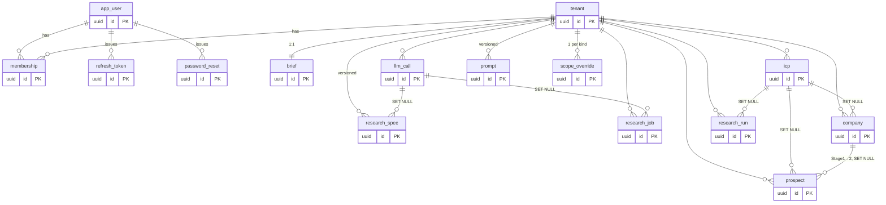

# HoldSlot Modularization Plan

> **Status:** PLAN ONLY — no code written. Authored 2026-06-24.
> **Stack (verified):** Next.js 16.2.9 (App Router) · React 19 · pnpm workspace. Installed deps:
> `clsx`, `date-fns`, `react-big-calendar`. ESLint 9 + `eslint-config-next`; **no** dead-code
> tooling yet.
> **Goal:** modularize the oversized web pages into per-page routes, and inventory the API + DB
> surface, before resuming the build plan.
> **Rule #1 for the frontend work:** do **not** change any business logic or CSS/visual styling of
> the current version. Every change below is either a pure file move, a behaviour-equivalent
> refactor, or explicitly gated behind founder approval.

Three parts: **(1)** frontend split (the active focus), **(2)** API inventory, **(3)** database ER.

The two refactor targets:

| File | Lines | Notes |
|---|---:|---|
| `apps/web/app/[client]/(console)/workspace/page.tsx` | 5,893 | 7-tab monolith, **live API-backed** (brief + list) |
| `apps/web/app/[client]/(console)/workspace/CampaignTab.tsx` | 930 | already extracted |
| `apps/web/app/[client]/(console)/client-status/page.tsx` | 680 | 3-tab monolith, **mock-data only** |

---

## PART 1 — Frontend modularization

### 1.0 Core decision: hash-tabs → real nested routes

Today both pages render **all tabs in one component** and toggle visibility with `display:none`,
syncing a `#hash` to a React context (`useStatusTab`) via a hand-rolled `popstate`/`hashchange`
listener + `history.pushState`. Per the request to "redesign the URL path", we convert hash
fragments into **real App Router segments**:

```
/holdslot/client-status#approval   →   /holdslot/client-status/approval
/holdslot/workspace#brief          →   /holdslot/workspace/brief
```

**The enabling fact:** in the App Router a `layout.tsx` **does not re-mount when navigating between
its child routes** — it persists. So a Client-Component `layout.tsx` is the correct home for the tab
bar **and** any cross-tab state that must survive sub-route navigation. This resolves every
"but the tabs share state" concern, and lets us **delete** the entire hash-sync apparatus
(`StatusTab`'s `useStatusTab` context, the `popstate`/`hashchange` effect, manual `pushState`).
Sidebar highlight + breadcrumb + back-button become `usePathname()`-derived.

### 1.1 Client Action pages (client-status → 3 routes)

```
app/[client]/(console)/client-status/
├── layout.tsx          NEW — Client Component: renders 3-tab bar into the topbar slot;
│                       highlights active tab via usePathname(); owns the "Back to …" link.
├── page.tsx            SHRINK — redirect → ./approval  (+ legacy #hash translation)
├── client-status.css   KEEP shared bits (.tabs, .es-section, .es-summary, .es-grid)
├── approval/page.tsx   ~225 ln (today 241–463) + template-editor state (tmpl/draft/editingTmpl)
│   └── approval.css    .tmpl-* styles
├── booking/page.tsx    ~120 ln (today 466–581) + `propose` inline-editor state
│   └── booking.css     .bk-* styles
└── feedback/page.tsx   ~95 ln (today 584–677), no local state
    └── feedback.css    .stars-sm etc.
```

**Why low-risk:** the 3 tabs are already decoupled — no shared state, three independent mock consts
(`A_LOG`/`B_LOG`/`F_LOG`), and the only page-level state (`tmpl`/`draft`/`editingTmpl`) is
approval-only. Move the three fixtures to `lib/fixtures/client-status.ts`.

### 1.2 Workspace (→ 7 routes)

```
app/[client]/(console)/workspace/
├── layout.tsx          NEW — Client Component: (a) renders 7-tab bar into topbar slot;
│                       (b) wraps children in <WorkspaceProvider> holding cross-tab MOCK state.
├── page.tsx            SHRINK — redirect → ./brief (+ legacy #hash translation)
├── brief/    page.tsx  ~1,500 ln — Brief intake + ICP profiles + Prospect Scope (API-backed)
│             brief.css   .brief-* .icp-*  (heaviest CSS slice)
├── list/     page.tsx  ~1,200 ln — 2-step Companies→People sourcing (keeps its OWN internal
│             list.css    Step-1/Step-2 sub-switch); .list-* .csp-* .cstudy .fit-*  (API-backed)
├── batches/  page.tsx  ~300 ln — approval batch cards + exclusion list  (.sob-*)
├── campaign/ page.tsx  ~60 ln  — wrapper → <CampaignTab/> (already extracted)  (.cmp-*)
├── replies/  page.tsx  ~200 ln — reply queue + draft editor  (.reply-*)
├── summaries/page.tsx  ~100 ln — meeting recaps  (.sum-*)
└── billing/  page.tsx  ~100 ln — billing ledger  (.ledger-*)
```

**Cross-tab coupling — where each piece lands:**

| Coupling | Today | After split |
|---|---|---|
| `batches` → Campaign (approved batches feed selector; lock seeds funnel) | top-level state | **`WorkspaceProvider` (layout)** |
| `campaigns` → Replies & Summaries filter dropdowns | top-level state | **`WorkspaceProvider`** (read-only) |
| `replies` mock list | top-level state | `WorkspaceProvider` or local to replies/ |
| `brief` / `icps` / `spec` / `prospects` / `companies` | **live API** | refetched per route — **no shared state** |
| `STATUS_LABEL`, `SOURCE_CLS/LABEL`, `BATCH_STATUS_CLS` (list + batches) | module consts | `lib/workspace/constants.ts` |

The API-backed tabs (brief, list) need **no** shared state — they round-trip the backend. Only the
**mock** state (`batches`, `campaigns`, `replies`) goes into the provider — a small, bounded context
that preserves the current batch→campaign demo reactivity across navigation.

**Extraction inventory** (the ~15 inline helpers in page.tsx today, all confirmed still used):

- → `components/workspace/`: `SpecReview`, `FitScore`, `CompanyStudy`, `TagInput`, `PillGroup`,
  `Lbl`, `Section`, `SpecCell/SpecHead/SpecChips`, `WebLink/LinkedInLink`, `ExclFormat`, `CsvErrors`.
- → `lib/workspace/types.ts`: `Batch`, `Campaign`, `Reply`, `Icp`, `Brief`, `ResearchSpecResult`.
- → `lib/workspace/fixtures.ts`: `LEDGER`, `RECAPS`, `INITIAL_REPLIES`, `EXCLUSIONS`, `SCORE_TIERS`,
  `SAMPLE_*`, initial `batches`/`campaigns`.

### 1.3 Shared mechanics (both 1.1 and 1.2)

1. **Sidebar** (`components/console/Sidebar.tsx`): change client-status links from
   `…/client-status#approval` to `…/client-status/approval`; highlight via `usePathname()` instead
   of `useStatusTab`. Workspace stays one sidebar link → resolves to `/brief`.
2. **ConsoleShell** (`components/console/ConsoleShell.tsx`): keep the `TopbarSlotCtx` portal (tab
   bars still mount into the topbar). Breadcrumb + "Back to …" derive from `usePathname()`.
   Remove `StatusTabCtx`.
3. **CSS slicing:** `workspace.css` (2,822 ln) is already class-selectors-only, so it splits by
   prefix into per-route files with **zero leakage risk** (honours CLAUDE.md's class-only rule). A
   small `workspace-shell.css` (`.tabs`, `.tabpane`, `.ws-tabs`) is imported by `layout.tsx`. Shared
   atoms (`.panel`, `.badge`, `.tbl`) stay in `globals.css`, untouched. **No CSS rule bodies change.**
4. **Legacy-link safety:** old emails/bookmarks may carry `#approval`/`#brief`. The shrunk base
   `page.tsx` reads `location.hash` on mount and redirects to the matching segment.

### 1.4 Prioritized execution plan (phases · steps · dependencies)

> Pure-refactor gate after every phase: `pnpm typecheck` + `pnpm build` must stay green; manual
> click-through must look pixel-identical. No copy, CSS-class, or behaviour change.

**Phase A — Client-status split (P0, do first: smallest, mock-only, proves the pattern).**
Dep: none.
- A1. Add `lib/fixtures/client-status.ts`; move `A_LOG`/`B_LOG`/`F_LOG`.
- A2. Add `client-status/layout.tsx` (tab bar → topbar slot; `usePathname()` highlight; back-link).
- A3. Add `approval/`, `booking/`, `feedback/` route folders, each `page.tsx` + co-located `.css`
  slice; move the matching JSX + the approval-only template state.
- A4. Shrink `client-status/page.tsx` to a redirect (`→ ./approval`) + legacy `#hash` translation.
- A5. Update `Sidebar.tsx` links + highlight; drop `StatusTabCtx` usage in `ConsoleShell.tsx`.
- A6. Verify (build + click-through approval/booking/feedback + deep-link + back-button).

**Phase B — Workspace shared groundwork (P1).** Dep: A (pattern proven).
- B1. `lib/workspace/types.ts` — move inline TS types.
- B2. `lib/workspace/constants.ts` — move shared lookup consts.
- B3. `lib/workspace/fixtures.ts` — move mock data.
- B4. `components/workspace/` — extract the ~15 inline sub-components (no logic change).
- B5. (If provider chosen) scaffold `WorkspaceProvider` holding `batches`/`campaigns`/`replies`.

**Phase C — Workspace route split (P1).** Dep: B.
- C1. `workspace/layout.tsx` (tab bar → topbar slot; wraps `<WorkspaceProvider>`).
- C2. Split the 5 self-contained tabs first (lowest risk): `billing`, `summaries`, `replies`,
  `batches`, `campaign` (wrapper around `CampaignTab`).
- C3. Split the two heavy API-backed tabs last: `brief`, `list` (each refetches on mount).
- C4. Shrink `workspace/page.tsx` to a redirect (`→ ./brief`) + legacy `#hash` translation.
- C5. Verify (build + full click-through, incl. the batch→campaign→replies reactivity).

**Phase D — Code-quality pass (P2, all approved — but secondary to the split).** Dep: C.
- D1. Pure perf (memoize derived lists + `React.memo` 3 components); dead-code (un-export 6 csv.ts
  helpers); safe package swaps (Modal → Radix, dates → date-fns); add `knip` to CI.
- D2. **Typed API client** (`openapi-typescript` + `openapi-fetch`) — separate sub-phase, **after**
  the split lands and is verified (never change structure + data-layer on the same axis). See §1.7.

**Phase E — Final verification.** Dep: all.
- `pnpm typecheck` + `pnpm lint` + `pnpm build`; **Playwright route-smoke** (each route renders +
  deep-link + back-button); manual click-through.

Dependency graph: **A → B → C → D1 → D2 → E** (A also de-risks C by proving the layout/route pattern).
Modularization (A–C) is P0; D1/D2 are P2 and must not delay or destabilize the split.

### 1.5 Code-quality review (Rule #1: no business-logic / CSS change)

**(a) Unused / dead code** — *very little; the split is clean.*

| Item | File | Verdict |
|---|---|---|
| `parseCsv`, `isDomain`, `normalizeDomain`, `normalizeUrl`, `rowsToText`, `ExclParseResult` exported but only used inside the module | `lib/csv.ts` | **SAFE** — drop the `export` keyword (make private); zero runtime effect |
| `ApiClient` type exported but only used inside `Me` | `lib/api.ts:10` | SAFE (minor) — can keep or inline |
| `.band-sub` (workspace.css), `.wrapflex` (globals.css) — no JSX references | CSS | **Likely-orphan, but NOT removed** — Rule #1 forbids CSS edits; listed for awareness only |
| Components / inline sub-components / state vars | all | **None unused** — every component, helper, and `useState` is referenced |
| Tooling | package.json | No `knip`/`ts-prune`/`unused-imports` — could add to catch future cruft |

**(b) Custom build → package** — ranked by value-vs-risk under Rule #1.

| Custom code | Lines | Package | Verdict |
|---|---:|---|---|
| `components/Modal.tsx` | 79 | `@radix-ui/react-dialog` (headless) | **SAFE swap** — keep all existing CSS classes + `modal.css`; better a11y/focus-trap; +~4K. Zero visual change. |
| `fmtShortDate`/`daysAgoLabel`/`MONTHS` (workspace) | ~12 | `date-fns` (**already installed**) | **SAFE swap** — `format(parseISO(x),'MMM d')` etc.; identical output; 0 bundle. |
| Hash/tab routing + `StatusTab` | ~50 | (none) native App Router | **Resolved by the split itself** — no package needed. |
| `lib/csv.ts` tokenizer | 60 of 229 | `papaparse` | **RISKY → defer/keep** — could change which rows validate; keep app-specific validation regardless. |
| `components/Toast.tsx` | 40 | `sonner` / `react-hot-toast` | **KEEP** — both ship their own CSS → visual drift; violates Rule #1. |
| `lib/useCountUp.ts` | 55 | `react-countup` | **KEEP** — tight + correct; swap not worth the churn. |
| `lib/tmpl.tsx` | 26 | — | **KEEP** — trivial, design-specific. |
| `lib/api.ts` (702) token+client | 702 | `openapi-fetch` + `openapi-typescript` | **APPROVED → Phase D2** (after the split). Investigated: schema is codegen-ready (§1.7). −~20K, kills ~70 hand-written fns. |
| Brief mega-form | ~5,000 | `react-hook-form` + `zod` | **DO NOT** — rewrites controlled inputs → logic/visual drift; +20K. Out of scope. |

**(c) Unoptimized code** — all behaviour/CSS-neutral; the split delivers the biggest win for free.

| Opt | Where | Impact | Risk |
|---|---|---|---|
| **Route split** — only the active tab's render tree + JS bundle loads (today every keystroke re-renders all 7 tabs; whole `"use client"` page ships at once) | the refactor itself | **Largest** — less re-render scope + smaller per-route JS | none (pure structure) |
| Memoize `toEnrich`/`enrichedSel`/`canBatch` | workspace ~2545–2549 | fewer array walks per keystroke | none (`useMemo`) |
| `React.memo` `FitScore`/`CompanyStudy`/`SpecChips` | workspace 533/620/688 | fewer row reconciliations | none |
| Memoize `rowsForCompany` / pre-compute `enrichedCount` | workspace 2497, 4528–4563 | fewer filter/sort ops per render | none |
| Memoize facet-options array in People-Scope modal | workspace ~5046 | fewer object allocs | none |
| Parallelize initial load (6 sequential `reload*` → `Promise.all`) | workspace ~2185 | faster mount | low — success path identical; `Promise.all` fails-fast vs sequential (error semantics only) |
| Parallelize `persist()` ICP updates/deletes | workspace ~2020–2050 | faster save | low — same caveat; preserve create-then-assign-id |
| Parallelize `confirmEnrich()` enrich+reload | workspace ~3042 | faster enrich | low — only if reload doesn't depend on enrich metadata |

> Memoization/`React.memo` items are **pure** (zero behaviour risk). Parallelization items are
> behaviour-equivalent on the success path but change error/ordering semantics slightly — include
> only with founder sign-off, and keep the create-then-assign-id step intact.

### 1.6 Risks & verification

- **Route-smoke tests (Playwright).** No FE test harness exists today (clean slate) → add
  `@playwright/test` to `apps/web` as a devDependency with a `playwright.config.ts` + a `test:e2e`
  script. Coverage: each new route renders without error, deep-linking to a sub-route lands on the
  right tab, the back-button restores the previous tab, and the legacy `#hash` redirect resolves.
  Playwright (real browser + real Next routing/history) is required here — Vitest/RTL cannot
  faithfully exercise routing or the back-button. Runs against `pnpm dev` (or `next start`).
- **CSS leakage** — mitigated because every page CSS is class-selectors-only already; slices keep
  rule bodies byte-identical.
- **Inbound links** — legacy `#hash` redirects preserve bookmarks/emails.
- **Pure refactor discipline** — no copy, token (`·` middot), or class-name changes; the design
  stays the spec.

### 1.7 Typed API client (Phase D2) — foundation DONE; migration scoped

**Delivered (committed, zero runtime risk):**
- `lib/api-types.ts` — **generated from the live `https://api.tryholdslot.com/openapi.json`**
  (OpenAPI 3.1.0 · 32 paths / 41 operations · 47 schemas; 2,786 lines). Types only — erased at
  build, no runtime cost, not yet imported (knip-ignored until the migration consumes it).
- `pnpm gen:api` script to regenerate the types when the API changes.

**Why the 70-function rewrite was NOT done in this pass (deliberate, per Rule #1).** `lib/api.ts`
is the **production** data layer: it owns auth-token storage, refresh-before-401, single-flight
refresh, and the `holdslot:tokens`/`holdslot:auth-expired` session events, and it drives the
**paid** Apollo find/enrich/score endpoints. A rip-and-replace of all ~70 functions can only be
verified here by `typecheck` + review — the auth-refresh middleware cannot be exercised against a
live authenticated session in this environment. Big-banging un-QA'able auth/billing code conflicts
with Rule #1, so the swap is staged, not forced.

**Scoped migration (do as a focused, dev-QA'd follow-up):**
1. Add `openapi-fetch` (~2.8K runtime). Create `lib/api-client.ts`:
   `createClient<paths>({ baseUrl })` + an `onRequest`/`onResponse` **middleware** that calls the
   *existing* `lib/api.ts` token helpers (get/refresh/clear + the events) so auth behaviour is
   byte-for-byte the same.
2. Migrate **read-only GETs first** (lowest risk): `getMe`, `getBrief`, `listIcps`,
   `getResearchSpec`, `listProspects`, `listCompanies`, `getSourcingDocs`,
   `get*ScopeOverride`/`departments`, prompt previews. Keep each exported function's **signature and
   return shape identical** (typecheck guards the ~30 call sites).
3. Then mutations (icp CRUD, brief put/structure, company/people select/find), each verified on the
   dev site.
4. **Paid endpoints last, one at a time, with manual dev-site QA**: `enrich` (the only credit
   spend), `find-company`/`find-people`/`find-lookalikes`, `rescore*`, `update-fields`.
5. Delete the hand-written `authFetch` wrapper only once every function is migrated. Net: −~20K
   bundle, ~70 fewer hand-written functions, full end-to-end types.

This honours the chosen "investigate now → scope the swap": the schema is proven codegen-ready, the
type foundation is in place, and the migration is a safe, ordered, independently-verifiable sequence
rather than a single risky cut over live revenue code.

---

## PART 2 — API inventory (41 endpoints)

FastAPI `HoldSlot API v0.1.0`. Auth = JWT Bearer (`HTTPBearer`); tenant scope via
`require_membership()` on every `/{client}/…` route (non-members → **404**, not 403).
`+Owner` = owner-role-gated. Swagger at `/docs`, ReDoc at `/redoc`. CORS via `HOLDSLOT_CORS_ORIGINS`.

| Feature | Method | Path | Purpose | Auth |
|---|---|---|---|---|
| Health | GET | `/health` | Liveness | Public |
| Auth | POST | `/auth/login` | Email/pw → access+refresh | Public |
| Auth | POST | `/auth/refresh` | Rotate access token | Public |
| Auth | POST | `/auth/forgot` | Begin pw reset (202) | Public |
| Auth | POST | `/auth/reset` | Complete pw reset | Public |
| Clients | GET | `/me` | Current user + memberships | JWT |
| Clients | GET | `/clients` | Tenants user belongs to | JWT |
| Clients | POST | `/clients` | Create tenant (→ owner) | JWT |
| Clients | GET | `/{client}/context` | Resolve + authorize tenant | +Member |
| Brief | GET | `/{client}/brief` | Get brief | +Member |
| Brief | PUT | `/{client}/brief` | Upsert brief | +Member |
| Brief | GET | `/{client}/brief/structure/preview` | Preview structuring prompt (free) | +Member |
| Brief | PUT | `/{client}/brief/structure/system-prompt` | Edit scoping prompt | +Member |
| Brief | POST | `/{client}/brief/structure` | Kick async structuring (LLM) | +Member |
| Brief | GET | `/{client}/brief/structure/status` | Poll structuring job | +Member |
| Brief | GET | `/{client}/research-spec` | Latest ResearchSpec + history | +Member |
| ICP | GET | `/{client}/icps` | List ICPs | +Member |
| ICP | POST | `/{client}/icps` | Create ICP | +Member |
| ICP | PUT | `/{client}/icps/{icp_id}` | Update ICP | +Member |
| ICP | DELETE | `/{client}/icps/{icp_id}` | Delete ICP | +Member |
| List (read) | GET | `/{client}/prospects` | People, sorted by fit | +Member |
| List (read) | GET | `/{client}/companies` | Companies (Stage 1), by fit | +Member |
| Companies | POST | `/{client}/companies` | Manually add one | +Owner |
| Companies | POST | `/{client}/companies/find-company` | Flow A: Apollo search→suppress→enrich→score | +Owner |
| Companies | POST | `/{client}/companies/find-lookalikes` | Lookalike peers (≤10 net-new) | +Owner |
| Companies | PATCH | `/{client}/companies/select` | Stage into Step 2 / remove | +Owner |
| Companies | POST | `/{client}/companies/rescore` | Re-run fit (≤15/req) | +Owner |
| Companies | POST | `/{client}/companies/update-fields` | Re-enrich firmographics (≤15/req) | +Owner |
| Companies | GET | `/{client}/fit-prompt` | Preview fit rubric prompt (free) | +Member |
| People | POST | `/{client}/people/find-people` | Flow B: people across orgs (free, ≤250) | +Owner |
| People | POST | `/{client}/people/facets` | Live seniority/dept counts (free) | +Owner |
| People | GET | `/{client}/people/scope-override` | Get saved Find Settings | +Member |
| People | PUT | `/{client}/people/scope-override` | Save Find Settings | +Owner |
| People | DELETE | `/{client}/people/scope-override` | Reset Find Settings | +Owner |
| People | GET | `/{client}/people/departments` | 14 master departments (static) | +Member |
| Prospects | POST | `/{client}/prospects` | Manually add one person | +Owner |
| Prospects | POST | `/{client}/prospects/rescore` | AI score people (≤15/req) | +Owner |
| Prospects | POST | `/{client}/prospects/enrich` | **Only credit spend**: Apollo people/match (≤15/req) | +Owner |
| Research | GET | `/{client}/research-runs` | Cost/credit scoreboard | +Member |
| Research | GET | `/{client}/sourcing-docs` | Get rubrics (company_fit + prospect_fit) | +Member |
| Research | POST | `/{client}/sourcing-docs` | Save rubric edit (append-only) | +Owner |

**Routers:** `auth` (`/auth`), `clients`, `briefs`, `icps`, `prospects` (largest, ~23 routes) — in
`apps/api/app/domains/<x>/router.py`.

**FE coverage gap:** the API serves **only** the workspace Brief + List tabs today. Batches,
Campaign, Replies, Summaries, Billing, and all of client-status are still **mock fixtures** with no
endpoints — i.e. where the backend grows next.

---

## PART 3 — Database (Aurora Postgres) — ER + schema

**15 tables**, head revision **`0013`**. Three clusters: Identity/Tenancy (global), Phase B
Targeting, Phase C Apollo find→enrich. ORM (`apps/api/app/models.py`) matches migrations — no drift.



**Relationship notes:**
- **`tenant` is the spine** — every business table `ON DELETE CASCADE`s from it.
- Identity is global — `app_user` ↔ `tenant` is many-to-many via `membership`;
  `refresh_token`/`password_reset` hang off the user.
- `icp` and `llm_call` are soft refs (`SET NULL`) — deleting them orphans but doesn't destroy.
- **Two-stage flow** — `company` (Stage 1, dedup `domain`, Apollo via `apollo_org_id`) →
  `prospect` (Stage 2, dedup `identity_key`, via `company_id` + `apollo_person_id`).
  `prospect.last_enriched_at` is the seam for a future shared `person`/enrichment cache.
- Versioned config — `research_spec` (per tenant), `prompt` (per tenant×stage:
  `briefing`/`company_fit`/`prospect_fit`), `research_run` (cost ledger) — all append-only.
- **Seed (tenant #0 `holdslot`)** — 2 founder owners + 3 prompt rows
  (`briefing` v1, `company_fit` v1, `prospect_fit` v1).

**Migration chain (head `0013`):** `0001` baseline identity → `0002` seed → `0003` Phase B
(brief/icp/llm_call/research_spec) → `0004` icp_suggestions → `0005` Phase C
(prospect/research_run/sourcing_doc) → `0006`/`0011` seed_limit add+drop → `0007` company +
`prospect.company_id` → `0008` company.website → `0009` research_job → `0010` `sourcing_doc`→`prompt`
rename → `0012` scope_override → `0013` `fit_scoring`→`company_fit` + seed `prospect_fit`.

---

## Locked decisions (founder, 2026-06-24)

1. **Scope** — bundle **all** related fixes (perf, dead-code, safe package swaps, tooling, typed
   client), but **prioritize the modularization**: the split (Phases A–C) ships and is verified
   first; the fixes (Phase D) are secondary and must not destabilize it.
2. **Workspace shared state** — **`WorkspaceProvider` in the layout** (preserves the batch→campaign
   reactivity exactly as today).
3. **API client** — **investigate now → approved for Phase D2** (after the split). Schema is
   codegen-ready; see §1.7.
4. **Verification** — **add a Playwright route-smoke test** (plus the build gate); see §1.6.

> Next gate: founder confirmation to begin **Phase A** (client-status split). No code until then.
